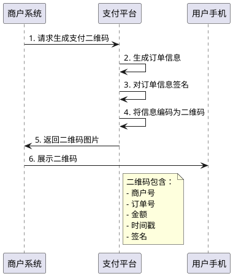
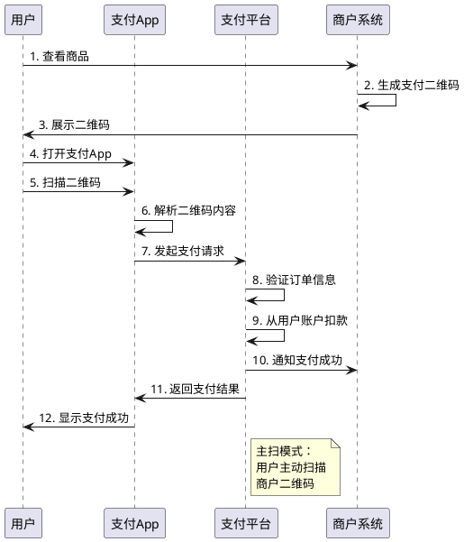
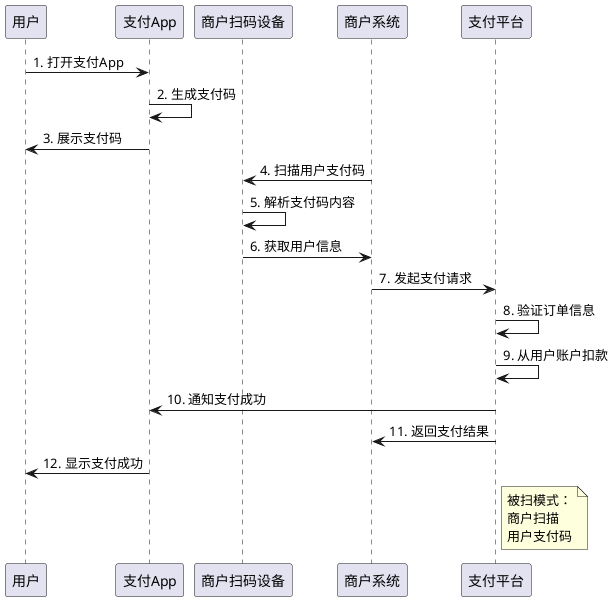
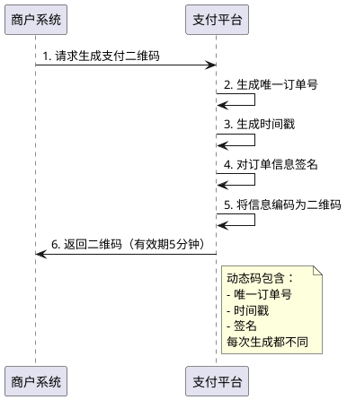
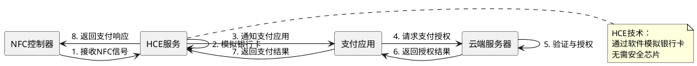
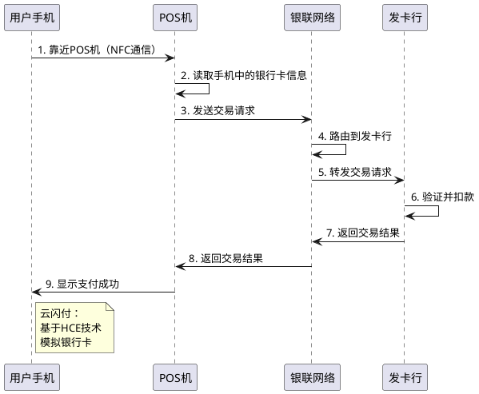
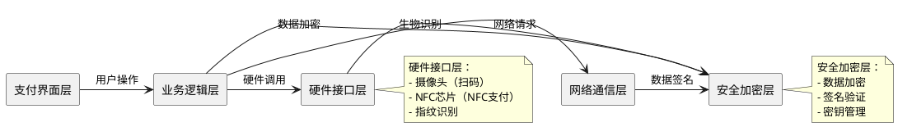
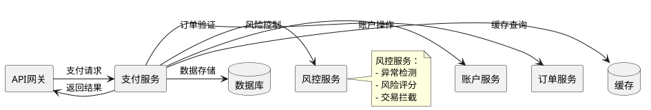
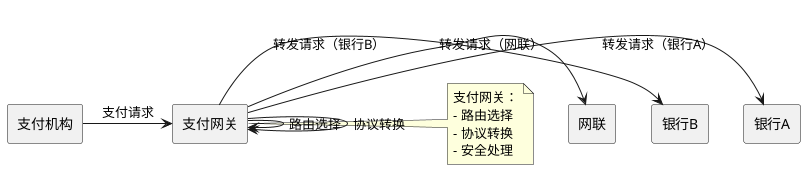

# 移动支付的技术原理

> **📖 阅读提示**：本文约 10000 字，预计阅读时间 20 分钟。建议按顺序阅读，每个概念都建立在前一个概念的基础上。本文是《中国线上支付与清结算体系深度解析》系列文章的第五篇，深入解析移动支付的技术原理。

## 📑 文章目录

1. [引言：从扫码支付说起](#引言从扫码支付说起)
2. [移动支付的技术基础](#移动支付的技术基础)
3. [移动支付的诞生背景](#移动支付的诞生背景)
4. [二维码支付的技术原理](#二维码支付的技术原理)
5. [NFC支付的技术原理](#nfc支付的技术原理)
6. [移动支付的技术架构](#移动支付的技术架构)
7. [移动支付对支付生态的影响](#移动支付对支付生态的影响)
8. [总结与预告](#总结与预告)

---

## 引言：从扫码支付说起

想象一下，你在便利店买一瓶水，收银员扫一下你手机上的二维码，3 秒钟就完成了支付。整个过程不需要现金，不需要银行卡，甚至不需要输入密码。

这就是**移动支付（Mobile Payment）**，它彻底改变了我们的支付方式。

**移动支付**是指通过移动设备（主要是智能手机）完成的支付行为。与传统的银行卡支付不同，移动支付将支付能力"装进了手机"，让支付变得随时随地、触手可及。

通俗来说，移动支付就像把钱包、银行卡、POS 机都装进了手机里。你只需要一部手机，就能完成几乎所有支付场景。

在本文中，我们将深入解析移动支付的技术原理，从智能手机的硬件能力开始，到二维码支付和 NFC 支付的技术实现，再到移动支付的技术架构，帮助你全面理解移动支付的工作原理。

---

## 移动支付的技术基础

移动支付的实现，离不开三个技术基础：**智能手机的硬件能力**、**移动网络的发展**和**生物识别技术**。

### 智能手机的硬件能力

**智能手机（Smartphone）** 是移动支付的载体，它提供了移动支付所需的硬件能力。

**核心硬件能力**：

1. **摄像头**：用于扫描二维码，实现主扫支付
2. **显示屏**：用于显示支付二维码，实现被扫支付
3. **NFC 芯片**：用于近场通信，实现 NFC 支付
4. **指纹识别模块**：用于身份验证，保障支付安全
5. **GPS 定位**：用于风险控制，识别异常交易位置

这些硬件能力，让手机从"通信工具"变成了"支付工具"。

### 移动网络的发展

移动支付需要实时联网，移动网络的发展为移动支付提供了基础设施。

**移动网络的发展历程**：

- **2G 时代（2000-2008 年）**：主要支持语音和短信，数据传输速度慢，无法支持移动支付
- **3G 时代（2009-2013 年）**：数据传输速度提升，可以支持简单的移动支付，但体验较差
- **4G 时代（2014 年至今）**：数据传输速度大幅提升，为移动支付的爆发提供了技术基础

**4G 网络对移动支付的意义**：

- **实时性**：支付请求可以实时传输，支付体验流畅
- **稳定性**：网络连接稳定，减少支付失败率
- **安全性**：支持 HTTPS 加密传输，保障支付安全

### 生物识别技术

**生物识别技术（Biometric Authentication）** 是移动支付的重要安全机制，用于验证用户身份。

**常见的生物识别技术**：

1. **指纹识别（Fingerprint Recognition）**：
   - 通过指纹传感器采集指纹信息
   - 与预先注册的指纹进行比对
   - 识别速度快，准确率高

2. **人脸识别（Face Recognition）**：
   - 通过前置摄像头采集人脸图像
   - 使用 AI 算法进行人脸识别
   - 无需接触，用户体验好

3. **声纹识别（Voice Recognition）**：
   - 通过麦克风采集声音特征
   - 分析声音的频谱特征
   - 主要用于语音支付场景

**生物识别在移动支付中的应用**：

- **支付密码替代**：使用指纹或人脸识别替代输入密码，提升支付体验
- **身份验证**：在支付前验证用户身份，保障支付安全
- **风险控制**：识别异常支付行为，如非本人操作

---

## 移动支付的诞生背景

移动支付的诞生，离不开技术成熟、场景需求和用户习惯的共同推动。让我们从历史背景开始，理解移动支付是如何一步步发展起来的。

### 历史背景：智能手机的快速普及

**2010-2013 年**：智能手机快速普及，移动互联网兴起。

**关键时间节点**：

- **2010 年**：iPhone 4 发布，智能手机开始普及
- **2011 年**：Android 系统快速发展，智能手机价格下降
- **2012 年**：中国智能手机用户突破 3 亿
- **2013 年**：4G 网络开始商用，移动网络速度大幅提升

**智能手机普及的意义**：

- **硬件基础**：智能手机提供了摄像头、NFC 等硬件能力
- **软件生态**：App 生态成熟，为移动支付提供了应用场景
- **用户习惯**：用户开始习惯使用手机完成各种操作

### 线下支付场景的需求

传统 POS 机的局限性，为移动支付提供了机会。

**传统 POS 机的问题**：

1. **成本高**：POS 机设备成本高，小商户难以承担
2. **安装复杂**：需要布线、申请等复杂流程
3. **使用不便**：需要刷卡、输入密码，操作繁琐
4. **场景受限**：只能在固定位置使用

**移动支付的优势**：

1. **成本低**：只需要打印二维码，成本几乎为零
2. **安装简单**：打印二维码即可，无需复杂安装
3. **使用便捷**：扫码即可支付，无需刷卡
4. **场景灵活**：可以在任何地方使用，不受位置限制

### 二维码支付的诞生

**2011 年**：支付宝推出二维码支付，这是中国移动支付的起点。

**二维码支付的优势**：

- **低成本**：只需要打印二维码，成本极低
- **易推广**：商户只需要打印二维码即可，无需额外设备
- **用户体验好**：扫码即可支付，操作简单
- **技术成熟**：二维码技术已经成熟，可以大规模应用

**2013 年**：微信支付推出，基于微信生态，快速获得用户。

微信支付的推出，标志着移动支付进入快速发展期。

### 微信支付的诞生背景

**2013 年**：微信支付正式上线，这是移动支付发展的重要节点。

**微信的快速发展**：

- **2011 年**：微信上线，用户快速增长
- **2013 年**：微信用户突破 3 亿，成为国民级应用
- **微信生态**：微信不仅是聊天工具，更是生活服务平台

**腾讯的支付布局**：

- **2005 年**：腾讯成立财付通，对标支付宝
- **早期业务**：QQ 钱包、游戏充值等
- **技术积累**：财付通在支付领域积累了丰富的技术经验

**为什么微信要做支付？**

1. **完善微信生态闭环**：
   - 微信已经覆盖了社交、生活服务等场景
   - 支付是生态闭环的关键环节
   - 有了支付，微信才能真正成为"生活方式"

2. **抓住移动支付机遇**：
   - 2013 年移动支付刚刚起步，市场空间巨大
   - 微信拥有庞大的用户基础，可以快速推广
   - 移动支付是未来趋势，必须抓住机遇

3. **与支付宝竞争**：
   - 支付宝在移动支付领域已经领先
   - 微信需要推出支付功能，与支付宝竞争
   - 支付是互联网巨头的必争之地

**微信红包的推动**：

**2014 年春节**：微信红包爆发，这是移动支付发展的重要推动力。

**微信红包的意义**：

- **用户教育**：通过红包，让用户习惯使用微信支付
- **社交属性**：红包具有社交属性，增强了用户粘性
- **快速推广**：春节期间，微信红包快速传播，用户快速增长

**数据**：2014 年春节，微信红包收发总量超过 10 亿个，微信支付绑卡用户快速增长。

### 移动支付的爆发原因

移动支付的爆发，是技术、场景、用户和政策共同推动的结果。

**1. 技术成熟**：

- **智能手机**：硬件能力成熟，摄像头、NFC 等技术可用
- **移动网络**：4G 网络普及，数据传输速度快
- **二维码技术**：二维码技术成熟，可以大规模应用

**2. 场景需求**：

- **线下支付痛点**：传统 POS 机成本高、使用不便
- **移动支付优势**：低成本、易推广、使用便捷
- **场景扩展**：从线上到线下，支付场景不断扩展

**3. 用户习惯**：

- **移动互联网普及**：用户习惯使用手机完成各种操作
- **支付习惯改变**：从现金、银行卡到移动支付
- **社交属性**：微信红包等创新玩法，增强用户粘性

**4. 政策支持**：

- **监管逐步放开**：监管对移动支付逐步认可
- **支付牌照制度**：支付牌照制度保障了行业规范
- **政策引导**：政策鼓励移动支付发展

---

## 二维码支付的技术原理

**二维码支付（QR Code Payment）** 是移动支付的主要形式，它通过扫描二维码完成支付。理解二维码支付的技术原理，是理解移动支付的关键。

### 什么是二维码？

**二维码（QR Code，Quick Response Code）** 是一种矩阵式二维条码，可以存储大量信息。

**二维码的特点**：

- **信息容量大**：可以存储数百个字符的信息
- **容错能力强**：即使部分损坏，也能正确识别
- **识别速度快**：扫描即可识别，速度极快
- **成本低**：打印成本极低，易于推广

**二维码的编码规则**：

二维码使用特定的编码规则，将信息转换为黑白方块矩阵。每个方块代表一个二进制位，通过不同的排列组合，可以表示不同的信息。

### 支付二维码的内容结构

支付二维码中存储的信息，决定了支付流程的走向。

**支付二维码的内容结构**：

```json
{
  "merchantId": "商户号",
  "orderId": "订单号",
  "amount": "金额",
  "timestamp": "时间戳",
  "sign": "签名"
}
```

**关键字段说明**：

- **merchantId**：商户号，标识收款商户
- **orderId**：订单号，唯一标识一笔交易
- **amount**：支付金额
- **timestamp**：时间戳，用于控制二维码有效期
- **sign**：签名，用于验证二维码的合法性

**二维码的生成流程**：



### 扫码支付的完整流程

扫码支付有两种模式：**主扫模式**和**被扫模式**。

#### 主扫模式：用户扫商户码

**主扫模式（User Scans Merchant Code）** 是指用户使用手机扫描商户的二维码，完成支付。

**流程说明**：

1. **商户生成二维码**：商户系统生成支付二维码，展示给用户
2. **用户扫码**：用户打开支付 App，扫描商户二维码
3. **解析二维码**：支付 App 解析二维码内容，获取订单信息
4. **发起支付**：支付 App 向支付平台发起支付请求
5. **验证与扣款**：支付平台验证订单信息，从用户账户扣款
6. **通知商户**：支付平台通知商户支付成功
7. **完成支付**：商户收到通知，完成交易



#### 被扫模式：商户扫用户码

**被扫模式（Merchant Scans User Code）** 是指商户使用扫码设备扫描用户手机上的支付码，完成支付。

**流程说明**：

1. **用户打开支付码**：用户打开支付 App，展示支付码
2. **商户扫码**：商户使用扫码设备扫描用户支付码
3. **解析支付码**：扫码设备解析支付码，获取用户信息
4. **发起支付**：商户系统向支付平台发起支付请求
5. **验证与扣款**：支付平台验证订单信息，从用户账户扣款
6. **通知用户**：支付平台通知用户支付成功
7. **完成支付**：用户收到通知，完成交易



**两种模式的对比**：

| 模式 | 优势 | 劣势 | 适用场景 |
|:---|:---|:---|:---|
| **主扫模式** | 商户成本低，只需打印二维码 | 需要用户主动扫码 | 超市、便利店等固定商户 |
| **被扫模式** | 支付速度快，用户体验好 | 需要商户配备扫码设备 | 餐厅、商场等需要快速支付的场景 |

### 二维码的安全机制

二维码支付的安全，是移动支付的核心问题。支付平台通过多种安全机制，保障支付安全。

#### 动态码 vs 静态码

**静态码（Static Code）** 是指二维码内容固定不变，可以重复使用。

**静态码的特点**：

- **成本低**：打印一次，可以长期使用
- **安全性低**：容易被复制，存在安全风险
- **适用场景**：个人收款、小额支付

**动态码（Dynamic Code）** 是指二维码内容动态生成，每次支付都不同。

**动态码的特点**：

- **安全性高**：每次支付都生成新的二维码，无法复制
- **时效性强**：二维码有时效性，过期自动失效
- **适用场景**：商户收款、大额支付

**动态码的生成机制**：



#### 时效性控制

**时效性控制**是指二维码具有有效期，过期自动失效。

**时效性控制的作用**：

- **防止重复使用**：二维码过期后无法再次使用
- **降低安全风险**：即使二维码被复制，过期后也无法使用
- **提升用户体验**：过期后自动刷新，用户无需手动操作

**时效性控制的实现**：

- **时间戳验证**：支付平台验证二维码中的时间戳
- **有效期设置**：通常设置为 5-10 分钟
- **自动刷新**：二维码过期后，自动生成新的二维码

#### 金额限制

**金额限制**是指对二维码支付的金额进行限制，降低安全风险。

**金额限制的类型**：

1. **单笔限额**：单次支付的最大金额
2. **日累计限额**：每日支付的最大累计金额
3. **商户限额**：不同商户有不同的限额

**金额限制的作用**：

- **风险控制**：降低大额支付的风险
- **用户保护**：防止用户误操作造成大额损失
- **合规要求**：满足监管对支付限额的要求

---

## NFC支付的技术原理

**NFC支付（NFC Payment）** 是移动支付的另一种形式，它通过近场通信技术完成支付。虽然在中国市场，NFC 支付的普及度不如二维码支付，但它在某些场景下具有独特优势。

### 什么是NFC？

**NFC（Near Field Communication，近场通信）** 是一种短距离无线通信技术，可以在 10 厘米以内进行数据传输。

**NFC的特点**：

- **距离短**：通信距离在 10 厘米以内，安全性高
- **速度快**：数据传输速度快，支付体验好
- **功耗低**：功耗低，对手机电池影响小
- **无需网络**：可以在没有网络的情况下完成支付

**NFC的技术标准**：

- **ISO 14443**：NFC 的底层通信协议
- **ISO 7816**：智能卡的标准
- **EMV**：银行卡支付的标准

### HCE技术

**HCE（Host Card Emulation，主机卡模拟）** 是 NFC 支付的核心技术，它让手机可以模拟银行卡。

**HCE的工作原理**：

传统 NFC 支付需要手机内置安全芯片（SE，Secure Element），但 HCE 技术让手机可以通过软件模拟银行卡，无需安全芯片。

**HCE的技术架构**：



**HCE的优势**：

- **成本低**：无需安全芯片，降低硬件成本
- **灵活性高**：可以通过软件更新，支持更多银行卡
- **用户体验好**：支付速度快，体验流畅

### 云闪付的技术实现

**云闪付（UnionPay QuickPass）** 是中国银联推出的 NFC 支付产品，基于 HCE 技术实现。

**云闪付的技术架构**：

1. **手机端**：通过 HCE 技术模拟银行卡
2. **POS 端**：支持 NFC 的 POS 机读取手机信息
3. **银联网络**：通过银联网络完成交易转接
4. **银行系统**：发卡行验证并完成扣款

**云闪付的支付流程**：



**云闪付的优势**：

- **支付速度快**：NFC 通信速度快，支付体验好
- **安全性高**：NFC 通信距离短，难以被窃听
- **无需网络**：可以在没有网络的情况下完成支付
- **用户体验好**：只需靠近 POS 机即可完成支付

**云闪付的局限性**：

- **硬件要求**：需要手机支持 NFC，POS 机支持 NFC
- **普及度低**：在中国市场，NFC 支付的普及度不如二维码支付
- **成本较高**：需要升级 POS 机，成本较高

---

## 移动支付的技术架构

移动支付的技术架构，包括**客户端 SDK**、**服务端 API**和**支付网关**三个核心部分。理解技术架构，有助于我们理解移动支付的完整实现。

### 客户端SDK的设计

**SDK（Software Development Kit，软件开发工具包）** 是移动支付客户端的技术基础。

**支付 SDK 的核心功能**：

1. **二维码生成与解析**：
   - 生成支付二维码
   - 解析商户二维码
   - 二维码的编码与解码

2. **NFC 支付支持**：
   - NFC 通信接口
   - HCE 服务实现
   - 支付码生成

3. **安全机制**：
   - 数据加密与签名
   - 生物识别集成
   - 风险控制

4. **用户界面**：
   - 支付密码输入
   - 支付结果展示
   - 支付历史查询

**SDK 的架构设计**：



### 服务端API的架构

**服务端 API**是移动支付的核心，负责处理支付请求、验证订单、完成扣款等核心业务。

**服务端 API 的核心功能**：

1. **订单管理**：
   - 订单创建
   - 订单查询
   - 订单状态更新

2. **支付处理**：
   - 支付请求处理
   - 支付验证
   - 资金扣款

3. **安全验证**：
   - 签名验证
   - 风险控制
   - 异常检测

4. **通知回调**：
   - 支付成功通知
   - 支付失败通知
   - 订单状态同步

**服务端 API 的架构设计**：



### 支付网关的作用

**支付网关（Payment Gateway）** 是连接支付机构和银行的中间层，负责处理支付请求的路由和转发。

**支付网关的核心功能**：

1. **路由选择**：
   - 根据支付方式选择路由
   - 根据银行选择通道
   - 负载均衡与故障转移

2. **协议转换**：
   - 统一支付接口
   - 不同银行协议的转换
   - 数据格式转换

3. **安全处理**：
   - 数据加密与解密
   - 签名验证
   - 安全传输

4. **监控与日志**：
   - 交易监控
   - 异常告警
   - 日志记录

**支付网关的架构设计**：



---

## 移动支付对支付生态的影响

移动支付的普及，对支付生态产生了深远影响。它不仅改变了支付方式，更改变了支付场景、用户习惯和行业格局。

### 支付场景的扩展

移动支付让支付场景从线上扩展到线下，从固定场景扩展到移动场景。

**支付场景的变化**：

1. **线上场景**：
   - **电商支付**：从网银支付到移动支付
   - **生活服务**：外卖、打车、购物等
   - **娱乐消费**：游戏充值、视频会员等

2. **线下场景**：
   - **零售支付**：超市、便利店、商场等
   - **餐饮支付**：餐厅、咖啡店等
   - **交通支付**：地铁、公交、出租车等

3. **移动场景**：
   - **随时随地支付**：不受时间和地点限制
   - **社交支付**：红包、转账等
   - **场景化支付**：根据场景自动推荐支付方式

### 支付习惯的改变

移动支付改变了用户的支付习惯，从现金、银行卡到移动支付。

**支付习惯的变化**：

1. **从现金到移动支付**：
   - **以前**：出门必须带现金
   - **现在**：一部手机走天下

2. **从银行卡到移动支付**：
   - **以前**：需要刷卡、输入密码
   - **现在**：扫码即可支付，无需密码

3. **从固定场景到移动场景**：
   - **以前**：只能在固定位置支付
   - **现在**：随时随地可以支付

**数据**：根据统计，中国移动支付用户已超过 10 亿，移动支付交易规模占支付总规模的 80% 以上。

### 对传统POS的冲击

移动支付对传统 POS 机产生了冲击，但也带来了新的机遇。

**传统 POS 机的挑战**：

1. **成本压力**：移动支付成本低，传统 POS 机成本高
2. **用户体验**：移动支付体验好，传统 POS 机操作繁琐
3. **场景受限**：移动支付场景灵活，传统 POS 机场景受限

**传统 POS 机的转型**：

1. **智能化升级**：POS 机支持扫码支付、NFC 支付
2. **功能扩展**：POS 机不仅是支付工具，更是商户管理工具
3. **场景融合**：POS 机与移动支付融合，提供更好的服务

**未来趋势**：

- **POS 机与移动支付融合**：POS 机支持多种支付方式
- **智能化 POS 机**：POS 机不仅是支付工具，更是数据采集工具
- **场景化 POS 机**：根据不同场景，提供定制化的 POS 解决方案

---

## 总结与预告

### 本文核心要点

在本文中，我们深入解析了移动支付的技术原理，包括：

1. **移动支付的技术基础**：
   - 智能手机的硬件能力
   - 移动网络的发展
   - 生物识别技术

2. **移动支付的诞生背景**：
   - 智能手机的快速普及
   - 线下支付场景的需求
   - 二维码支付的诞生
   - 微信支付的诞生背景

3. **二维码支付的技术原理**：
   - 二维码的编码规则
   - 支付二维码的内容结构
   - 主扫模式与被扫模式
   - 二维码的安全机制

4. **NFC支付的技术原理**：
   - NFC 技术标准
   - HCE 技术
   - 云闪付的技术实现

5. **移动支付的技术架构**：
   - 客户端 SDK 的设计
   - 服务端 API 的架构
   - 支付网关的作用

6. **移动支付对支付生态的影响**：
   - 支付场景的扩展
   - 支付习惯的改变
   - 对传统 POS 的冲击

### 关键概念回顾

- **移动支付（Mobile Payment）**：通过移动设备完成的支付行为
- **二维码支付（QR Code Payment）**：通过扫描二维码完成的支付
- **NFC支付（NFC Payment）**：通过近场通信技术完成的支付
- **HCE（Host Card Emulation）**：主机卡模拟技术，让手机可以模拟银行卡
- **主扫模式（User Scans Merchant Code）**：用户扫描商户二维码
- **被扫模式（Merchant Scans User Code）**：商户扫描用户支付码
- **动态码（Dynamic Code）**：内容动态生成的二维码，安全性高
- **静态码（Static Code）**：内容固定不变的二维码，成本低

### 下篇预告

在下一篇文章中，我们将深入解析**支付牌照制度与监管体系**，包括：

- 支付牌照制度的建立背景
- 支付牌照的分类与要求
- 备付金管理制度
- 持牌机构与无牌机构的区别
- 支付牌照对行业的影响

通过理解支付牌照制度，我们可以更好地理解支付行业的合规边界与技术实现，为后续理解网联的清算机制打下基础。

---

## 参考资料

- [微信支付商户平台文档](https://pay.weixin.qq.com/)
- [支付宝开放平台文档](https://open.alipay.com/)
- [中国银联技术规范](https://www.unionpay.com/)
- [NFC 技术标准](https://www.nfc-forum.org/)
- [移动支付安全技术规范](https://www.pbc.gov.cn/)

---

**最后更新**：2025-11-22  
**系列文章**：《中国线上支付与清结算体系深度解析》第五篇

