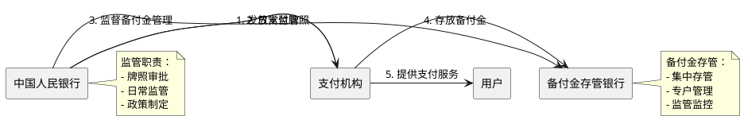
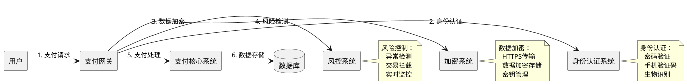
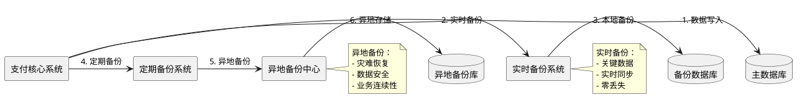
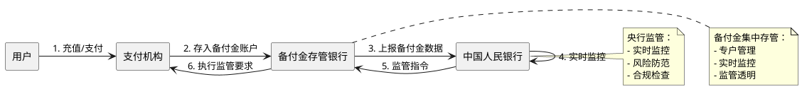
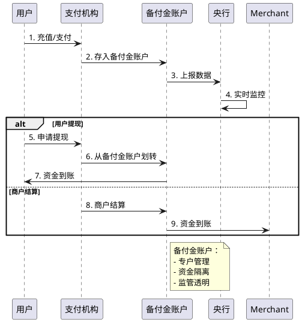
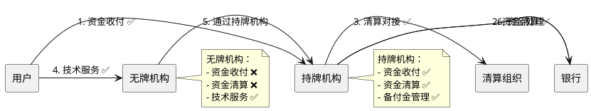

# 支付牌照制度与监管体系

> **📖 阅读提示**：本文约 10000 字，预计阅读时间 20 分钟。建议按顺序阅读，每个概念都建立在前一个概念的基础上。本文是《中国线上支付与清结算体系深度解析》系列文章的第六篇，深入解析支付牌照制度与监管体系。

## 📑 文章目录

1. [引言：从"无证驾驶"说起](#引言从无证驾驶说起)
2. [支付牌照制度的建立](#支付牌照制度的建立)
3. [支付牌照的分类](#支付牌照的分类)
4. [支付牌照的技术要求](#支付牌照的技术要求)
5. [备付金管理制度](#备付金管理制度)
6. [持牌机构与无牌机构的区别](#持牌机构与无牌机构的区别)
7. [支付牌照对行业的影响](#支付牌照对行业的影响)
8. [总结与预告](#总结与预告)

---

## 引言：从"无证驾驶"说起

想象一下，在 2010 年之前，中国的第三方支付行业就像一条没有红绿灯的马路。任何人都可以"开车上路"，没有统一的规则，没有明确的标准，也没有有效的监管。

支付宝、财付通等支付机构在快速发展，但行业缺乏规范，资金安全存在隐患。就像没有驾照的司机在路上开车，虽然可能技术不错，但缺乏统一的管理和保障。

**2010 年 6 月**，央行发布《非金融机构支付服务管理办法》，支付牌照制度正式建立。这就像给所有"司机"发放了"驾照"，只有通过考试、符合条件的企业才能从事支付业务。

**支付牌照（Payment License）** 是央行向符合条件的非金融机构颁发的，允许其从事支付业务的许可证。就像驾驶执照一样，支付牌照是从事支付业务的"准入证"。

通俗来说，支付牌照就像开餐厅需要营业执照一样，只有获得支付牌照的企业，才能合法地从事支付业务，为用户提供支付服务。

在本文中，我们将深入解析支付牌照制度与监管体系，从支付牌照的建立背景开始，到支付牌照的分类和技术要求，再到备付金管理制度，帮助你全面理解支付行业的合规边界与技术实现。

---

## 支付牌照制度的建立

### 历史背景：第三方支付的快速发展

**2004-2010 年**：第三方支付行业快速发展，但缺乏统一监管。

**关键时间节点**：

- **2004 年**：支付宝推出担保交易模式，第三方支付开始兴起
- **2005 年**：财付通成立，第三方支付市场开始竞争
- **2008 年**：支付宝用户数突破 1 亿，成为主流支付工具
- **2010 年**：第三方支付交易规模快速增长，但行业缺乏规范

**第三方支付快速发展带来的问题**：

1. **资金安全风险**：
   - 支付机构资金管理不规范，存在资金挪用风险
   - 备付金账户管理混乱，资金安全无法保障
   - 用户资金可能面临损失

2. **监管盲区**：
   - 支付机构不受金融监管，业务行为缺乏约束
   - 资金流向不透明，央行无法监控
   - 无法有效防范洗钱、非法集资等风险

3. **行业乱象**：
   - 无牌机构从事支付业务，扰乱市场秩序
   - 支付机构服务质量参差不齐
   - 用户权益无法保障

### 《非金融机构支付服务管理办法》的出台

**2010 年 6 月**，央行发布《非金融机构支付服务管理办法》（以下简称《办法》），支付牌照制度正式建立。

**《办法》的核心内容**：

1. **准入制度**：
   - 从事支付业务必须获得支付牌照
   - 明确支付机构的准入条件和申请流程
   - 建立支付机构的退出机制

2. **业务规范**：
   - 明确支付机构的业务范围
   - 规范支付机构的业务行为
   - 建立支付机构的业务报告制度

3. **资金管理**：
   - 要求支付机构建立备付金管理制度
   - 规范备付金账户的管理
   - 保障用户资金安全

4. **监管要求**：
   - 建立支付机构的监管体系
   - 明确监管部门的职责
   - 建立违规处罚机制

**《办法》的意义**：

- **规范行业**：通过支付牌照制度，规范了第三方支付行业
- **保障安全**：通过资金管理要求，保障了用户资金安全
- **促进发展**：通过统一标准，促进了行业健康发展

### 监管机构：中国人民银行

**中国人民银行（People's Bank of China，PBOC）** 是支付牌照的监管机构，负责支付牌照的审批、管理和监督。

**央行的监管职责**：

1. **牌照审批**：
   - 审核支付机构的申请材料
   - 评估支付机构的资质和能力
   - 决定是否发放支付牌照

2. **日常监管**：
   - 监督支付机构的业务行为
   - 检查支付机构的资金管理
   - 处理支付机构的违规行为

3. **政策制定**：
   - 制定支付行业的监管政策
   - 完善支付行业的法律法规
   - 推动支付行业的健康发展

**监管体系**：



---

## 支付牌照的分类

支付牌照不是"一刀切"的，而是根据业务类型进行分类。就像驾驶执照分为 A 照、B 照、C 照一样，支付牌照也分为不同的类型。

### 网络支付

**网络支付（Online Payment）** 是指通过互联网完成的支付行为。就像在网上购物时使用支付宝、微信支付一样。

**网络支付的分类**：

1. **互联网支付（Internet Payment）**：
   - **定义**：通过互联网完成的支付
   - **应用场景**：电商支付、在线充值、虚拟商品购买等
   - **技术实现**：通过网页、API 接口等方式完成支付

2. **移动电话支付（Mobile Payment）**：
   - **定义**：通过移动电话完成的支付
   - **应用场景**：手机 App 支付、扫码支付等
   - **技术实现**：通过移动网络、NFC 等方式完成支付

3. **固定电话支付（Fixed-line Payment）**：
   - **定义**：通过固定电话完成的支付
   - **应用场景**：电话购物、电话充值等
   - **技术实现**：通过固定电话网络完成支付

4. **数字电视支付（Digital TV Payment）**：
   - **定义**：通过数字电视完成的支付
   - **应用场景**：电视购物、付费节目等
   - **技术实现**：通过数字电视网络完成支付

**网络支付的特点**：

- **实时性**：支付可以实时完成
- **便捷性**：用户无需到现场，可以远程完成支付
- **场景丰富**：支持多种支付场景

### 银行卡收单

**银行卡收单（Bank Card Acquiring）** 是指支付机构为商户提供银行卡支付受理服务。就像商户使用 POS 机接受银行卡支付一样。

**银行卡收单的分类**：

1. **线上收单（Online Acquiring）**：
   - **定义**：通过互联网完成的银行卡收单
   - **应用场景**：电商网站、在线商城等
   - **技术实现**：通过支付网关、API 接口等方式完成收单

2. **线下收单（Offline Acquiring）**：
   - **定义**：通过 POS 机等设备完成的银行卡收单
   - **应用场景**：实体店、餐厅、超市等
   - **技术实现**：通过 POS 机、扫码设备等方式完成收单

**银行卡收单的特点**：

- **需要与银行对接**：收单机构需要与银行系统对接
- **需要与清算组织对接**：收单机构需要与银联、网联等清算组织对接
- **需要商户资质审核**：收单机构需要对商户进行资质审核

### 预付卡发行与受理

**预付卡（Prepaid Card）** 是指支付机构发行的，可以在指定商户使用的储值卡。就像超市的购物卡、公交卡一样。

**预付卡的分类**：

1. **单用途预付卡（Single-purpose Prepaid Card）**：
   - **定义**：只能在单一商户使用的预付卡
   - **应用场景**：超市购物卡、餐厅储值卡等
   - **监管要求**：不需要支付牌照，但需要备案

2. **多用途预付卡（Multi-purpose Prepaid Card）**：
   - **定义**：可以在多个商户使用的预付卡
   - **应用场景**：通用购物卡、礼品卡等
   - **监管要求**：需要支付牌照

**预付卡的特点**：

- **资金沉淀**：预付卡资金会沉淀在支付机构
- **使用限制**：预付卡只能在指定商户使用
- **监管严格**：预付卡受到严格监管，防止资金风险

### 支付牌照的分类体系

**支付牌照的分类体系**：

| 牌照类型 | 业务范围 | 典型机构 | 技术特点 |
|:---|:---|:---|:---|
| **网络支付** | 互联网支付、移动支付等 | 支付宝、微信支付 | 需要互联网基础设施 |
| **银行卡收单** | 线上收单、线下收单 | 拉卡拉、汇付天下 | 需要与银行、清算组织对接 |
| **预付卡发行与受理** | 单用途预付卡、多用途预付卡 | 资和信、开联通 | 需要资金管理能力 |

**支付机构可以申请多种牌照**：

- **支付宝**：拥有网络支付、银行卡收单牌照
- **微信支付（财付通）**：拥有网络支付、银行卡收单牌照
- **拉卡拉**：拥有银行卡收单牌照

---

## 支付牌照的技术要求

获得支付牌照不是一件容易的事，支付机构需要满足严格的技术要求。就像考驾照需要通过理论和实践考试一样，支付机构需要通过技术审核。

### 系统安全要求

**系统安全（System Security）** 是支付牌照的核心要求。支付系统必须能够保障用户资金安全和数据安全。

**系统安全的技术要求**：

1. **数据加密**：
   - **传输加密**：使用 HTTPS、TLS 等协议，保障数据传输安全
   - **存储加密**：敏感数据加密存储，防止数据泄露
   - **密钥管理**：建立完善的密钥管理体系，保障密钥安全

2. **身份认证**：
   - **用户身份验证**：通过密码、手机验证码、生物识别等方式验证用户身份
   - **商户身份验证**：对商户进行资质审核，保障商户真实性
   - **系统身份验证**：系统间通信需要身份验证，防止非法访问

3. **访问控制**：
   - **权限管理**：建立完善的权限管理体系，控制用户访问权限
   - **操作审计**：记录所有操作日志，便于审计和追溯
   - **异常检测**：实时检测异常访问，及时拦截风险操作

**系统安全的技术架构**：



### 数据备份机制

**数据备份（Data Backup）** 是支付系统的重要保障机制。支付系统必须建立完善的数据备份机制，防止数据丢失。

**数据备份的技术要求**：

1. **备份策略**：
   - **实时备份**：关键数据实时备份，保障数据不丢失
   - **定期备份**：定期备份全量数据，保障数据可恢复
   - **异地备份**：在异地建立备份中心，防止灾难性损失

2. **备份存储**：
   - **多副本存储**：数据多副本存储，提高可靠性
   - **加密存储**：备份数据加密存储，保障数据安全
   - **版本管理**：备份数据版本管理，支持数据回滚

3. **恢复机制**：
   - **快速恢复**：建立快速恢复机制，缩短恢复时间
   - **恢复测试**：定期进行恢复测试，保障恢复能力
   - **恢复流程**：建立完善的恢复流程，保障恢复有序

**数据备份的技术架构**：



### 风险控制体系

**风险控制（Risk Control）** 是支付系统的核心能力。支付系统必须建立完善的风险控制体系，防范支付风险。

**风险控制的技术要求**：

1. **实时监控**：
   - **交易监控**：实时监控交易行为，识别异常交易
   - **账户监控**：实时监控账户行为，识别异常账户
   - **系统监控**：实时监控系统运行状态，及时发现故障

2. **风险识别**：
   - **规则引擎**：通过规则引擎识别风险交易
   - **机器学习**：通过机器学习模型识别风险模式
   - **人工审核**：对高风险交易进行人工审核

3. **风险处置**：
   - **自动拦截**：对高风险交易自动拦截
   - **人工处理**：对可疑交易进行人工处理
   - **风险报告**：定期生成风险报告，分析风险趋势

**风险控制的技术架构**：

```plantuml
@startuml
!define COMPONENT rectangle

COMPONENT "支付请求" as Request
COMPONENT "风险控制引擎" as RiskEngine
COMPONENT "规则引擎" as RuleEngine
COMPONENT "机器学习模型" as MLModel
COMPONENT "人工审核" as Manual
COMPONENT "支付处理" as Payment

Request -> RiskEngine: 1. 支付请求
RiskEngine -> RuleEngine: 2. 规则匹配
RiskEngine -> MLModel: 3. 模型评分
RiskEngine -> RiskEngine: 4. 风险评分

alt 低风险
  RiskEngine -> Payment: 5. 通过，继续支付
else 中风险
  RiskEngine -> Manual: 6. 人工审核
  Manual -> Payment: 7. 审核通过
else 高风险
  RiskEngine -> Request: 8. 拦截，拒绝支付
end

note right of RiskEngine
  风险控制：
  - 实时监控
  - 风险识别
  - 风险处置
end note
@enduml
```

### 资金安全保障

**资金安全（Fund Security）** 是支付牌照的核心要求。支付机构必须建立完善的资金安全保障机制。

**资金安全保障的技术要求**：

1. **账户隔离**：
   - **备付金账户**：用户资金存放在专门的备付金账户中
   - **自有资金账户**：支付机构自有资金与用户资金分离
   - **专户管理**：备付金账户专户管理，不得挪用

2. **资金监管**：
   - **实时监控**：实时监控资金流向，及时发现异常
   - **限额管理**：设置资金限额，防止大额资金风险
   - **资金冻结**：对异常资金进行冻结，保障资金安全

3. **资金划转**：
   - **授权机制**：资金划转需要授权，防止非法划转
   - **审核机制**：大额资金划转需要审核，保障资金安全
   - **记录机制**：记录所有资金划转，便于审计和追溯

---

## 备付金管理制度

**备付金（Reserve Fund）** 是支付牌照制度的核心概念。理解备付金管理制度，是理解支付牌照制度的关键。

### 备付金的定义

**备付金**是支付机构为办理客户委托的支付业务而实际收到的预收待付货币资金。

通俗来说，备付金就是支付机构暂时保管的客户资金。就像你买东西时先付的押金，等交易完成后，再决定是退给你还是给商家。

**备付金的来源**：

1. **用户充值**：用户将银行账户资金转入支付账户
2. **支付资金**：用户支付给商户，但商户尚未提现
3. **担保交易**：在担保交易模式下，资金暂时存放在支付机构

**备付金的性质**：

- **用户资金**：备付金是用户资金，不是支付机构的自有资金
- **暂时保管**：支付机构只是暂时保管，不能随意使用
- **专户管理**：备付金必须存放在专门的银行账户中

### 备付金集中存管（2019 年）

**2019 年 1 月**，央行实施备付金集中存管制度，要求所有支付机构将备付金存放在央行指定的银行账户中。

**备付金集中存管的意义**：

1. **保障资金安全**：
   - 备付金存放在央行指定的银行账户中，由央行统一监管
   - 支付机构无法挪用备付金，保障用户资金安全
   - 降低支付机构资金管理风险

2. **提高监管透明度**：
   - 央行可以实时监控备付金账户的资金流向
   - 提高监管透明度，便于发现和防范风险
   - 防止洗钱、非法集资等违法行为

3. **规范行业秩序**：
   - 统一备付金管理标准，规范行业秩序
   - 防止支付机构通过备付金进行不正当竞争
   - 促进支付行业健康发展

**备付金集中存管的实施**：



### 备付金账户的管理

**备付金账户（Reserve Fund Account）** 是存放备付金的专门账户。

**备付金账户的管理要求**：

1. **专户管理**：
   - 备付金账户与支付机构自有资金账户分离
   - 备付金账户只能用于支付业务，不能用于其他用途
   - 备付金账户需要向央行备案

2. **资金划转**：
   - 备付金划转需要符合监管要求
   - 大额资金划转需要审核
   - 资金划转需要记录，便于审计

3. **账户监管**：
   - 央行可以实时监控备付金账户
   - 支付机构需要定期向央行报告备付金情况
   - 央行可以随时检查备付金账户

**备付金账户的管理流程**：



### 备付金利息的归属

**备付金利息（Reserve Fund Interest）** 是备付金存放在银行账户中产生的利息。

**备付金利息的归属**：

- **2019 年之前**：备付金利息归支付机构所有，支付机构可以用于投资理财
- **2019 年之后**：备付金集中存管后，备付金利息归用户所有，支付机构不能使用

**备付金利息归属的变化**：

1. **2019 年之前**：
   - 支付机构可以将备付金存放在银行，获得利息收入
   - 备付金利息是支付机构的重要收入来源
   - 支付机构可以通过备付金进行投资理财

2. **2019 年之后**：
   - 备付金集中存管，利息归用户所有
   - 支付机构无法通过备付金获得利息收入
   - 支付机构需要寻找其他收入来源

**备付金利息归属变化的影响**：

- **对支付机构**：失去了备付金利息收入，需要寻找其他收入来源
- **对用户**：备付金利息归用户所有，但用户通常无法直接获得
- **对行业**：促进了支付机构向服务收费模式转变

---

## 持牌机构与无牌机构的区别

支付牌照是从事支付业务的"准入证"。持牌机构与无牌机构在业务范围、资金处理权限、监管要求等方面存在显著区别。

### 业务范围限制

**持牌机构（Licensed Institution）** 是指获得支付牌照的支付机构，可以合法从事支付业务。

**无牌机构（Unlicensed Institution）** 是指未获得支付牌照的机构，不能从事支付业务。

**业务范围的对比**：

| 业务类型 | 持牌机构 | 无牌机构 |
|:---|:---|:---|
| **资金收付** | ✅ 可以 | ❌ 不可以 |
| **资金清算** | ✅ 可以 | ❌ 不可以 |
| **备付金管理** | ✅ 可以 | ❌ 不可以 |
| **技术服务** | ✅ 可以 | ✅ 可以 |
| **系统集成** | ✅ 可以 | ✅ 可以 |

**持牌机构的业务范围**：

1. **资金收付**：
   - 可以接受用户资金
   - 可以向商户支付资金
   - 可以处理资金流转

2. **资金清算**：
   - 可以与银行、清算组织对接
   - 可以处理资金清算
   - 可以提供清算服务

3. **备付金管理**：
   - 可以管理用户备付金
   - 可以开设备付金账户
   - 可以处理备付金划转

**无牌机构的业务限制**：

1. **不能资金收付**：
   - 不能直接接受用户资金
   - 不能直接向商户支付资金
   - 不能处理资金流转

2. **不能资金清算**：
   - 不能与银行、清算组织直接对接
   - 不能处理资金清算
   - 不能提供清算服务

3. **可以技术服务**：
   - 可以提供技术服务
   - 可以提供系统集成
   - 可以通过持牌机构提供支付服务

### 资金处理权限

**资金处理权限（Fund Processing Authority）** 是指机构处理资金的权限。

**持牌机构的资金处理权限**：

1. **资金收付权限**：
   - 可以接受用户资金
   - 可以向商户支付资金
   - 可以处理资金流转

2. **备付金管理权限**：
   - 可以管理用户备付金
   - 可以开设备付金账户
   - 可以处理备付金划转

3. **资金清算权限**：
   - 可以与银行、清算组织对接
   - 可以处理资金清算
   - 可以提供清算服务

**无牌机构的资金处理限制**：

1. **不能直接处理资金**：
   - 不能直接接受用户资金
   - 不能直接向商户支付资金
   - 不能直接处理资金流转

2. **必须通过持牌机构**：
   - 必须通过持牌机构处理资金
   - 必须通过持牌机构提供支付服务
   - 不能直接与银行、清算组织对接

**资金处理权限的对比**：



### 监管要求差异

**监管要求（Regulatory Requirements）** 是指机构需要遵守的监管规定。

**持牌机构的监管要求**：

1. **准入要求**：
   - 需要满足注册资本要求
   - 需要满足技术能力要求
   - 需要满足资金管理要求

2. **日常监管**：
   - 需要定期向央行报告业务情况
   - 需要接受央行的现场检查
   - 需要遵守监管规定

3. **违规处罚**：
   - 违规行为会受到处罚
   - 严重违规可能被吊销牌照
   - 需要承担法律责任

**无牌机构的监管要求**：

1. **不能从事支付业务**：
   - 不能直接从事支付业务
   - 不能处理资金收付
   - 不能管理备付金

2. **可以技术服务**：
   - 可以提供技术服务
   - 可以提供系统集成
   - 可以通过持牌机构提供支付服务

3. **违规处罚**：
   - 无牌从事支付业务会受到处罚
   - 可能面临法律风险
   - 需要承担法律责任

**监管要求的对比**：

| 监管要求 | 持牌机构 | 无牌机构 |
|:---|:---|:---|
| **准入要求** | 严格 | 不适用 |
| **日常监管** | 严格 | 宽松 |
| **违规处罚** | 严格 | 严格 |
| **业务限制** | 较少 | 较多 |

---

## 支付牌照对行业的影响

支付牌照制度的建立，对支付行业产生了深远影响。它不仅规范了行业秩序，也改变了行业格局。

### 行业集中度提升

**行业集中度（Industry Concentration）** 是指行业中头部企业所占的市场份额。

**支付牌照制度对行业集中度的影响**：

1. **准入门槛提高**：
   - 支付牌照申请条件严格，小企业难以获得
   - 只有具备一定实力的企业才能获得牌照
   - 提高了行业准入门槛

2. **头部企业优势**：
   - 支付宝、微信支付等头部企业获得牌照，占据市场主导地位
   - 头部企业技术实力强，服务质量高
   - 头部企业资金实力强，可以持续投入

3. **小企业退出**：
   - 无法获得牌照的小企业被迫退出市场
   - 行业集中度不断提高
   - 市场格局趋于稳定

**行业集中度的变化**：

- **2010 年之前**：行业集中度低，市场参与者众多
- **2010-2015 年**：支付牌照制度建立，行业集中度开始提升
- **2015 年之后**：行业集中度进一步提高，头部企业占据主导地位

### 技术门槛提高

**技术门槛（Technical Threshold）** 是指从事支付业务所需的技术能力。

**支付牌照制度对技术门槛的影响**：

1. **系统安全要求**：
   - 支付系统必须满足严格的安全要求
   - 需要建立完善的安全体系
   - 需要持续投入安全技术

2. **风险控制要求**：
   - 支付系统必须建立完善的风险控制体系
   - 需要实时监控交易风险
   - 需要及时处置风险事件

3. **资金管理要求**：
   - 支付系统必须建立完善的资金管理体系
   - 需要符合备付金管理要求
   - 需要接受监管检查

**技术门槛的提高**：

- **系统复杂度**：支付系统复杂度不断提高，需要更强的技术能力
- **安全要求**：安全要求不断提高，需要持续投入安全技术
- **监管要求**：监管要求不断提高，需要更强的合规能力

### 合规成本增加

**合规成本（Compliance Cost）** 是指机构为遵守监管规定而付出的成本。

**支付牌照制度对合规成本的影响**：

1. **牌照申请成本**：
   - 申请支付牌照需要投入大量人力物力
   - 需要满足严格的准入条件
   - 需要持续维护牌照资质

2. **日常运营成本**：
   - 需要建立完善的合规体系
   - 需要定期向央行报告业务情况
   - 需要接受监管检查

3. **技术投入成本**：
   - 需要持续投入安全技术
   - 需要建立完善的风险控制体系
   - 需要符合监管技术要求

**合规成本的变化**：

- **2010 年之前**：合规成本较低，主要是技术投入
- **2010-2019 年**：合规成本逐步增加，主要是牌照维护和监管合规
- **2019 年之后**：合规成本进一步增加，主要是备付金集中存管和技术升级

### 行业规范化发展

**行业规范化（Industry Standardization）** 是指行业按照统一标准规范发展。

**支付牌照制度对行业规范化的影响**：

1. **统一标准**：
   - 支付牌照制度建立了统一的行业标准
   - 所有持牌机构需要遵守相同的标准
   - 促进了行业规范化发展

2. **监管透明**：
   - 支付牌照制度提高了监管透明度
   - 央行可以实时监控行业情况
   - 便于发现和防范风险

3. **用户权益保障**：
   - 支付牌照制度保障了用户资金安全
   - 提高了支付服务质量
   - 保障了用户权益

**行业规范化的发展**：

- **2010 年之前**：行业缺乏统一标准，发展不规范
- **2010-2015 年**：支付牌照制度建立，行业开始规范化
- **2015 年之后**：行业规范化程度不断提高，发展更加健康

---

## 总结与预告

### 本文核心要点

在本文中，我们深入解析了支付牌照制度与监管体系，包括：

1. **支付牌照制度的建立**：
   - 2010 年央行发布《非金融机构支付服务管理办法》，支付牌照制度正式建立
   - 支付牌照制度规范了第三方支付行业，保障了用户资金安全

2. **支付牌照的分类**：
   - **网络支付**：互联网支付、移动支付、固定电话支付、数字电视支付
   - **银行卡收单**：线上收单、线下收单
   - **预付卡发行与受理**：单用途预付卡、多用途预付卡

3. **支付牌照的技术要求**：
   - **系统安全要求**：数据加密、身份认证、访问控制
   - **数据备份机制**：实时备份、定期备份、异地备份
   - **风险控制体系**：实时监控、风险识别、风险处置
   - **资金安全保障**：账户隔离、资金监管、资金划转

4. **备付金管理制度**：
   - **备付金的定义**：支付机构暂时保管的客户资金
   - **备付金集中存管**：2019 年实施，备付金存放在央行指定的银行账户中
   - **备付金账户管理**：专户管理、资金划转、账户监管
   - **备付金利息归属**：2019 年后归用户所有，支付机构不能使用

5. **持牌机构与无牌机构的区别**：
   - **业务范围限制**：持牌机构可以资金收付、资金清算，无牌机构只能技术服务
   - **资金处理权限**：持牌机构可以直接处理资金，无牌机构必须通过持牌机构
   - **监管要求差异**：持牌机构监管严格，无牌机构监管宽松

6. **支付牌照对行业的影响**：
   - **行业集中度提升**：准入门槛提高，头部企业占据主导地位
   - **技术门槛提高**：系统安全、风险控制、资金管理要求不断提高
   - **合规成本增加**：牌照申请、日常运营、技术投入成本增加
   - **行业规范化发展**：统一标准、监管透明、用户权益保障

### 关键概念回顾

- **支付牌照（Payment License）**：央行向符合条件的非金融机构颁发的，允许其从事支付业务的许可证
- **网络支付（Online Payment）**：通过互联网完成的支付行为
- **银行卡收单（Bank Card Acquiring）**：支付机构为商户提供银行卡支付受理服务
- **预付卡（Prepaid Card）**：支付机构发行的，可以在指定商户使用的储值卡
- **备付金（Reserve Fund）**：支付机构为办理客户委托的支付业务而实际收到的预收待付货币资金
- **备付金集中存管（Reserve Fund Centralized Custody）**：备付金存放在央行指定的银行账户中，由央行统一监管
- **持牌机构（Licensed Institution）**：获得支付牌照的支付机构
- **无牌机构（Unlicensed Institution）**：未获得支付牌照的机构

### 下篇预告

在本文中，我们深入理解了支付牌照制度与监管体系。但是，我们还没有涉及一个重要的问题：**第三方支付如何与银行完成资金清算？**

在下一篇文章《网联的清算原理与技术架构》中，我们将深入解析：

- **网联成立的背景**："断直连"前的支付模式、为什么需要网联、网联的成立
- **"断直连"政策详解**：政策要求、实施时间表、"断直连"前后的对比
- **网联清算的技术架构**：网联核心系统架构、交易转接流程、清算数据处理、结算资金划转
- **网联清算的时效性**：实时清算、清算周期
- **网联对支付行业的影响**：统一清算、技术标准化、成本变化、系统改造

通过下一篇文章的学习，我们将全面理解网联的清算机制，掌握"断直连"政策的技术实现，为后续学习微信支付的技术架构打下基础。

---

## 参考资料

- 《非金融机构支付服务管理办法》（中国人民银行，2010 年）
- 《支付机构客户备付金存管办法》（中国人民银行，2013 年）
- 《关于实施支付机构客户备付金集中存管有关事项的通知》（中国人民银行，2017 年）
- 《支付机构客户备付金集中存管操作指引》（中国人民银行，2019 年）
- 中国人民银行支付结算司官方文件
- 支付行业发展报告

---

**最后更新**：2025-11-23  
**系列文章**：《中国线上支付与清结算体系深度解析》第六篇

