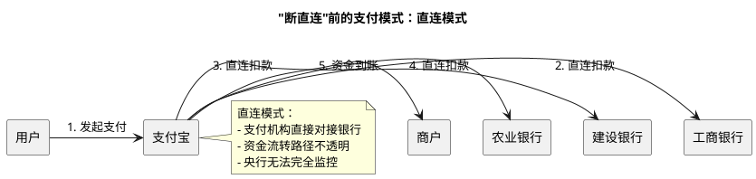
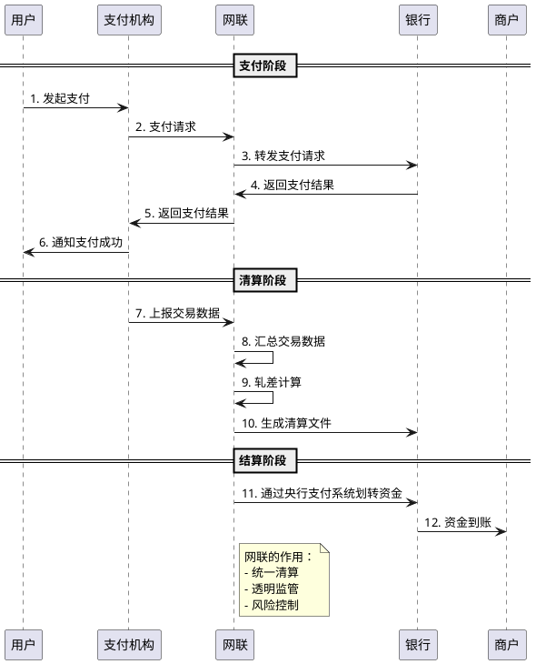
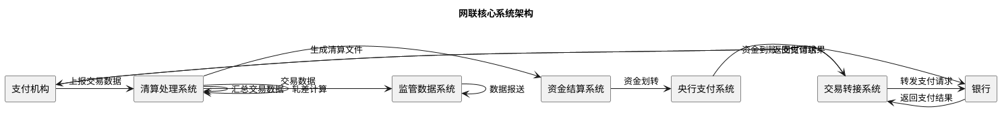
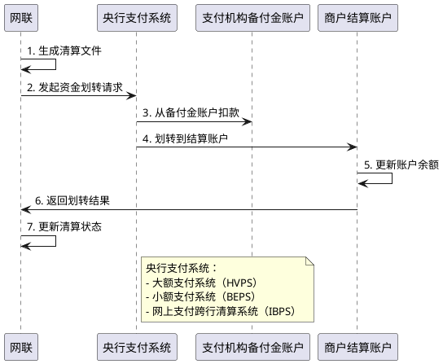

# 网联的清算原理与技术架构

> **📖 阅读提示**：本文约 12000 字，预计阅读时间 25 分钟。建议按顺序阅读，每个概念都建立在前一个概念的基础上。本文是支付清结算系列的第七篇，建议先阅读前面的文章，特别是《第三方支付的技术原理与资金流转》和《支付牌照制度与监管体系》。

## 📑 文章目录

1. [引言：从"断直连"说起](#引言从断直连说起)
2. [网联成立的背景](#网联成立的背景)
3. [网联的定位与职责](#网联的定位与职责)
4. ["断直连"政策详解](#断直连政策详解)
5. [网联清算的技术架构](#网联清算的技术架构)
6. [网联清算的时效性](#网联清算的时效性)
7. [网联对支付行业的影响](#网联对支付行业的影响)
8. [总结与预告](#总结与预告)

---

## 引言：从"断直连"说起

想象一下，你通过支付宝给朋友转账 100 元。在 2018 年之前，这笔钱可能直接从你的银行账户，通过支付宝与银行的直连通道，转到朋友的银行账户。整个过程，央行可能无法完全掌握资金流向。

**这就是"断直连"前的支付模式**：第三方支付机构直接与银行对接，资金流转路径不透明。

**2018 年 6 月 30 日**，央行要求所有第三方支付机构必须通过**网联（Non-bank Payment Institution Network）**进行清算，禁止支付机构直连银行。这就是"断直连"政策。

**网联是什么？**

**网联（Non-bank Payment Institution Network）** 是网络支付清算平台，负责处理支付宝、微信支付等网络支付的清算业务。

通俗来说，网联就像网络支付领域的"银联"。银联负责银行卡的清算，网联负责网络支付的清算。就像快递中转站一样，所有网络支付都必须经过网联，才能完成资金清算。

**为什么需要网联？**

在"断直连"之前，第三方支付机构直接与银行对接，存在以下问题：

1. **监管盲区**：央行无法完全掌握资金流向，存在监管盲区
2. **备付金管理风险**：资金沉淀在支付机构，存在资金安全风险
3. **清算数据缺失**：无法统一清算，清算数据不完整
4. **系统性风险**：支付机构与银行直接对接，风险集中

网联的成立，就是为了解决这些问题，实现统一清算、透明监管、风险可控。

在本文中，我们将深入解析网联的清算机制，从"断直连"政策的历史背景开始，到网联清算的技术架构，再到网联对支付行业的影响，帮助你全面理解网络支付清算平台的完整技术流程。

---

## 网联成立的背景

### "断直连"前的支付模式

在理解网联之前，我们需要先理解"断直连"前的支付模式。

#### 直连模式的技术架构

**直连模式（Direct Connection）** 是指第三方支付机构直接与银行对接，不经过清算组织的支付模式。

通俗来说，直连模式就像你直接给朋友打电话，不需要通过电话总机。支付机构直接与银行建立连接，资金直接从银行账户流转。

**直连模式的技术架构**：

**直连模式的特点**：

1. **资金流转路径**：用户 → 支付机构 → 银行（直连）→ 商户
2. **清算方式**：支付机构与银行直接清算
3. **监管情况**：资金流向不透明，央行无法完全监控
4. **技术实现**：支付机构需要与每家银行建立直连通道

#### 直连模式的优势

直连模式在当时有其优势：

1. **效率高**：直接对接，减少中间环节，支付速度快
2. **成本低**：无需通过清算组织，减少清算费用
3. **灵活性强**：支付机构可以根据业务需求，灵活选择合作银行

#### 直连模式的问题

但直连模式也存在严重问题：

1. **监管盲区**：
   - 资金流向不透明，央行无法完全掌握资金流转路径
   - 无法监控支付机构的资金使用情况
   - 存在洗钱、资金挪用等风险

2. **备付金管理风险**：
   - 资金沉淀在支付机构，存在资金安全风险
   - 支付机构可能挪用备付金，用于其他业务
   - 如果支付机构倒闭，用户资金可能无法追回

3. **清算数据缺失**：
   - 无法统一清算，清算数据不完整
   - 央行无法掌握完整的支付数据
   - 无法进行有效的风险监控

4. **系统性风险**：
   - 支付机构与银行直接对接，风险集中
   - 如果支付机构出现问题，可能影响整个支付体系
   - 缺乏统一的风险控制机制

### 为什么需要网联？

基于直连模式的问题，央行决定建立统一的网络支付清算平台——网联。

#### 监管需求

**央行需要掌握资金流向**：

在直连模式下，央行无法完全掌握资金流向。就像快递公司不知道包裹的具体路径一样，央行不知道资金是如何流转的。

通过网联，所有网络支付都必须经过网联，央行可以实时监控所有资金流向，实现透明监管。

#### 风险控制

**统一清算，降低系统性风险**：

在直连模式下，如果支付机构出现问题，可能影响整个支付体系。就像如果快递公司的某个中转站出现问题，可能影响所有包裹的配送。

通过网联，所有网络支付都通过统一的清算平台，可以统一进行风险控制，降低系统性风险。

#### 标准化

**统一接口，规范行业**：

在直连模式下，每家支付机构都需要与每家银行建立直连通道，接口不统一，技术标准不统一。

通过网联，所有支付机构都通过统一的接口对接，技术标准统一，行业规范化。

#### 备付金管理

**集中存管，保障资金安全**：

在直连模式下，备付金分散在各个支付机构，存在资金安全风险。

通过网联，备付金可以集中存管，由央行统一监管，保障资金安全。

### 网联的成立

#### 成立时间节点

**2017 年 3 月 31 日**：网联平台正式启动试运行。

**2017 年 8 月 29 日**：网联平台正式注册成立，全称为"网联清算有限公司"。

**2018 年 6 月 30 日**：央行要求所有第三方支付机构必须完成"断直连"，所有网络支付必须通过网联清算。

#### 股东结构

**网联是谁的？**

网联是由央行主导，支付机构参股成立的股份制公司：

- **股东**：包括支付宝、微信支付等支付机构，以及部分银行
- **性质**：股份制公司，非营利性质
- **监管**：中国人民银行监管

**通俗解释**：

网联不是某一家支付机构的，而是所有支付机构共同拥有的。就像小区的快递中转站不是某一栋楼的，而是整个小区共同建设的。

**与银联的区别**：

- **银联**：由银行共同发起成立，负责银行卡清算
- **网联**：由支付机构参股成立，负责网络支付清算

---

## 网联的定位与职责

### 网联的定位

**网联（Non-bank Payment Institution Network）** 是网络支付清算平台，负责处理支付宝、微信支付等网络支付的清算业务。

**通俗解释**：网联就像网络支付领域的"银联"。银联负责银行卡的清算，网联负责网络支付的清算。

**专业定义**：网联是经中国人民银行批准成立的非银行支付机构网络支付清算平台，负责处理非银行支付机构发起的网络支付业务的清算。

### 网联与银联的区别

网联和银联都是清算组织，但负责的业务不同：

| 对比项 | 银联 | 网联 |
|:---|:---|:---|
| **业务范围** | 银行卡清算 | 网络支付清算 |
| **服务对象** | 银行、收单机构 | 支付机构（支付宝、微信支付等） |
| **成立时间** | 2002 年 | 2017 年 |
| **股东结构** | 银行共同发起 | 支付机构参股 |
| **清算方式** | 银行卡交易转接与清算 | 网络支付交易转接与清算 |

**通俗类比**：

- **银联**：就像银行卡的"快递中转站"，所有银行卡交易都经过银联
- **网联**：就像网络支付的"快递中转站"，所有网络支付都经过网联

### 网联的业务范围

网联的业务范围主要包括：

1. **网络支付清算**：
   - 处理支付宝、微信支付等网络支付的清算业务
   - 汇总交易数据，计算资金差额
   - 生成清算文件

2. **交易转接**：
   - 接收支付机构的支付请求
   - 转发到相应的银行
   - 返回支付结果

3. **资金清算**：
   - 计算各支付机构之间的资金差额
   - 通过央行支付系统完成资金划转

4. **监管数据报送**：
   - 向央行报送交易数据
   - 支持监管部门的监管需求

---

## "断直连"政策详解

### 政策要求

**"断直连"政策**是指央行要求所有第三方支付机构必须通过网联进行清算，禁止支付机构直连银行的监管政策。

**政策核心要求**：

1. **所有网络支付必须通过网联清算**：
   - 支付机构不能直接与银行对接
   - 所有网络支付必须经过网联
   - 网联负责统一清算

2. **禁止支付机构直连银行**：
   - 支付机构不能直接与银行建立支付通道
   - 必须通过网联进行资金清算
   - 违反规定的机构将受到处罚

3. **备付金集中存管**：
   - 支付机构的备付金必须集中存管
   - 由央行统一监管
   - 保障资金安全

### 实施时间表

**"断直连"的实施时间表**：

1. **2017 年 3 月**：网联平台启动试运行
2. **2017 年 8 月**：网联平台正式注册成立
3. **2017 年 12 月**：央行发布"断直连"通知
4. **2018 年 6 月 30 日**：完成"断直连"，所有网络支付必须通过网联清算

**分阶段实施**：

- **第一阶段**：大型支付机构（支付宝、微信支付等）先行接入
- **第二阶段**：中型支付机构接入
- **第三阶段**：小型支付机构接入

### "断直连"前后的对比

#### 断直连前的支付模式

**资金流转路径**：用户 → 支付机构 → 银行（直连）→ 商户

**清算方式**：支付机构与银行直接清算

**监管情况**：资金流向不透明，央行无法完全监控

**优势**：
- 效率高：直接对接，减少中间环节
- 成本低：无需通过清算组织

**问题**：
- 监管盲区：资金流向不透明
- 备付金管理风险：资金沉淀在支付机构
- 清算数据缺失：无法统一清算
- 系统性风险：风险集中

#### 断直连后的支付模式

**资金流转路径**：用户 → 支付机构 → 网联 → 银行 → 商户

**清算方式**：统一通过网联清算

**监管情况**：资金流向透明，可监控

**优势**：
- 监管透明：央行可以监控所有资金流向
- 风险可控：统一清算，降低系统性风险
- 标准化：统一接口，规范行业
- 资金安全：备付金集中存管

**变化**：
- 效率：略有降低（增加网联环节）
- 成本：略有增加（清算费用）

### "断直连"的技术实现

#### 系统改造

**支付机构的系统改造**：

1. **API 对接**：
   - 支付机构需要对接网联 API
   - 替换原有的银行直连接口
   - 统一使用网联接口

2. **系统架构调整**：
   - 调整支付流程，增加网联环节
   - 修改清算逻辑，通过网联清算
   - 调整资金流转路径

3. **测试与验证**：
   - 进行系统测试
   - 验证支付流程
   - 确保系统稳定

#### 清算流程

**"断直连"后的清算流程**：

---

## 网联清算的技术架构

### 网联核心系统架构

网联的核心系统架构包括以下几个部分：

1. **交易转接系统**：
   - 接收支付机构的支付请求
   - 转发到相应的银行
   - 返回支付结果

2. **清算处理系统**：
   - 汇总交易数据
   - 计算资金差额
   - 生成清算文件

3. **资金结算系统**：
   - 通过央行支付系统完成资金划转
   - 管理备付金账户
   - 处理资金清算

4. **监管数据系统**：
   - 向央行报送交易数据
   - 支持监管部门的监管需求
   - 提供数据查询和分析功能

### 交易转接流程

#### 支付请求的转接

**支付机构 → 网联 → 银行**：

1. **支付机构发起支付请求**：
   - 用户发起支付
   - 支付机构生成支付请求
   - 发送到网联

2. **网联转发支付请求**：
   - 网联接收支付请求
   - 根据银行信息，转发到相应的银行
   - 记录交易信息

3. **银行处理支付请求**：
   - 银行接收支付请求
   - 验证账户信息
   - 处理支付请求

4. **返回支付结果**：
   - 银行返回支付结果
   - 网联转发支付结果
   - 支付机构通知用户

#### 交易路由机制

**交易路由（Transaction Routing）** 是网联根据支付信息，决定将支付请求转发到哪家银行的机制。

通俗来说，交易路由就像快递选择走哪条路线。网联根据支付信息（如银行卡号、银行代码等），查询路由表，将支付请求转发到正确的银行。

**路由表的组成**：

- **银行代码**：唯一标识一家银行
- **银行名称**：银行的名称
- **接口地址**：银行的接口地址
- **状态**：银行接口的状态（正常、异常等）

**路由算法**：

1. **根据银行代码查询路由表**
2. **检查银行接口状态**
3. **选择可用的银行接口**
4. **转发支付请求**

### 清算数据处理

#### 实时清算机制

**实时清算（Real-time Clearing）** 是指交易完成后立即进行清算，而不是等到批量清算时间。

通俗来说，实时清算就像当场算账。每笔交易完成后，立即进行清算，不需要等到每天结束。

**实时清算的优势**：

1. **资金到账快**：交易完成后立即清算，资金到账快
2. **风险控制及时**：可以及时发现异常交易
3. **用户体验好**：资金到账快，用户体验好

**实时清算的技术实现**：

1. **交易数据实时上报**：
   - 支付机构实时上报交易数据
   - 网联实时接收交易数据
   - 实时进行数据校验

2. **实时轧差计算**：
   - 实时汇总交易数据
   - 实时计算资金差额
   - 实时生成清算文件

3. **实时资金划转**：
   - 实时通过央行支付系统划转资金
   - 实时更新账户余额
   - 实时通知支付机构

#### 清算文件格式

**清算文件（Clearing File）** 是网联生成的，记录清算结果的文件。

**清算文件的内容**：

1. **交易明细**：
   - 交易编号
   - 交易时间
   - 交易金额
   - 支付机构信息
   - 银行信息

2. **轧差结果**：
   - 各支付机构之间的资金差额
   - 应收应付金额
   - 清算时间

3. **结算信息**：
   - 结算账户信息
   - 资金划转路径
   - 结算时间

**清算文件的格式**：

网联使用标准的清算文件格式，包括：

- **文件头**：文件的基本信息（文件编号、生成时间等）
- **交易明细**：每笔交易的详细信息
- **轧差结果**：各支付机构之间的资金差额
- **文件尾**：文件的校验信息

#### 轧差计算

**轧差计算（Netting Calculation）** 是清算的核心算法，用于计算各支付机构之间的资金差额。

**轧差计算的原理**：

假设有 A、B、C 三家支付机构：

- A 的客户向 B 的客户转账：总共 1000 万元
- B 的客户向 C 的客户转账：总共 800 万元
- C 的客户向 A 的客户转账：总共 500 万元

**轧差计算过程**：

1. **汇总交易数据**：
   - A → B：1000 万元
   - B → C：800 万元
   - C → A：500 万元

2. **计算净额**：
   - A 应收：500 万元（C → A）
   - A 应付：1000 万元（A → B）
   - A 净额：应付 500 万元（1000 - 500 = 500）
   
   - B 应收：1000 万元（A → B）
   - B 应付：800 万元（B → C）
   - B 净额：应收 200 万元（1000 - 800 = 200）
   
   - C 应收：800 万元（B → C）
   - C 应付：500 万元（C → A）
   - C 净额：应收 300 万元（800 - 500 = 300）

3. **生成清算结果**：
   - A 向 B 支付 500 万元
   - B 向 C 支付 200 万元（实际上 B 应收 200 万元，C 应收 300 万元，但通过多边轧差可以优化）

**多边轧差优化**：

通过多边轧差，可以优化资金流转路径，减少实际的资金划转次数。例如，上面的例子中，通过多边轧差，可以简化为：A 向 C 支付 500 万元，B 向 C 支付 200 万元。

### 结算资金划转

#### 备付金集中存管

**备付金集中存管（Centralized Reserve Fund Management）** 是指支付机构的备付金必须存放在央行指定的银行账户，由央行统一监管。

**备付金集中存管的意义**：

1. **保障资金安全**：备付金集中存管，由央行统一监管，保障资金安全
2. **防止资金挪用**：支付机构无法挪用备付金，用于其他业务
3. **统一管理**：央行可以统一管理所有备付金，便于监管

**备付金账户体系**：

- **备付金账户**：支付机构在央行指定的银行开立的备付金账户
- **清算账户**：网联在央行开立的清算账户
- **结算账户**：商户在银行开立的结算账户

#### 资金划拨流程

**资金划拨流程**：

1. **网联生成清算文件**：
   - 汇总交易数据
   - 计算资金差额
   - 生成清算文件

2. **通过央行支付系统划转资金**：
   - 网联通过央行支付系统（如大额支付系统 HVPS）划转资金
   - 从支付机构的备付金账户划出资金
   - 划转到商户的结算账户

3. **资金到账**：
   - 银行接收资金
   - 更新账户余额
   - 通知商户

---

## 网联清算的时效性

### 实时清算：7×24 小时

**网联清算的时效性**：

网联支持**7×24 小时实时清算**，即每周 7 天、每天 24 小时都可以进行清算。

通俗来说，网联就像 24 小时营业的便利店，随时都可以进行清算，不需要等到固定的时间。

**实时清算的优势**：

1. **资金到账快**：交易完成后立即清算，资金到账快
2. **用户体验好**：资金到账快，用户体验好
3. **风险控制及时**：可以及时发现异常交易

### 清算周期：T+0 为主

**网联清算的周期**：

网联清算以**T+0（当天清算）**为主，即交易当天完成清算。

**T+0 的含义**：

- **T**：交易日（Transaction Day）
- **T+0**：交易当天完成清算

**清算时间节点**：

- **实时清算**：交易完成后立即清算
- **批量清算**：每天固定时间进行批量清算（如每天 23:00）

**清算时效性对比**：

| 清算方式 | 时效性 | 说明 |
|:---|:---|:---|
| **实时清算** | T+0（实时） | 交易完成后立即清算 |
| **批量清算** | T+0（当天） | 每天固定时间进行批量清算 |

### 与银联清算的对比

**网联与银联清算的时效性对比**：

| 对比项 | 银联 | 网联 |
|:---|:---|:---|
| **清算周期** | T+1（次日清算） | T+0（当天清算） |
| **清算时间** | 每天固定时间（如 23:00） | 7×24 小时实时清算 |
| **清算方式** | 批量清算为主 | 实时清算为主 |

**为什么网联支持实时清算？**

1. **技术基础**：网联采用现代化的技术架构，支持实时清算
2. **业务需求**：网络支付需要实时清算，提升用户体验
3. **监管要求**：实时清算可以及时发现异常交易，便于监管

---

## 网联对支付行业的影响

### 统一清算：监管透明化

**网联对监管的影响**：

1. **资金流向透明**：
   - 所有网络支付都经过网联，央行可以实时监控所有资金流向
   - 资金流转路径清晰，便于监管

2. **数据完整**：
   - 网联汇总所有交易数据，数据完整
   - 央行可以掌握完整的支付数据

3. **风险可控**：
   - 统一清算，可以统一进行风险控制
   - 及时发现异常交易，降低系统性风险

### 技术标准化：接口统一

**网联对技术标准化的影响**：

1. **统一接口**：
   - 所有支付机构都通过统一的接口对接网联
   - 接口标准统一，技术规范统一

2. **降低对接成本**：
   - 支付机构不需要与每家银行建立直连通道
   - 只需要对接网联，降低对接成本

3. **提升效率**：
   - 统一接口，提升对接效率
   - 减少重复开发，提升开发效率

### 成本变化：清算费用

**网联对成本的影响**：

1. **清算费用**：
   - 通过网联清算，需要支付清算费用
   - 相比直连模式，成本略有增加

2. **对接成本**：
   - 支付机构需要对接网联，需要一定的开发成本
   - 但相比与多家银行对接，成本降低

3. **总体成本**：
   - 清算费用略有增加
   - 但对接成本降低
   - 总体成本变化不大

### 系统改造：支付机构的技术调整

**支付机构的系统改造**：

1. **API 对接**：
   - 支付机构需要对接网联 API
   - 替换原有的银行直连接口
   - 统一使用网联接口

2. **系统架构调整**：
   - 调整支付流程，增加网联环节
   - 修改清算逻辑，通过网联清算
   - 调整资金流转路径

3. **测试与验证**：
   - 进行系统测试
   - 验证支付流程
   - 确保系统稳定

**系统改造的挑战**：

1. **技术复杂度**：系统改造涉及多个模块，技术复杂度高
2. **时间紧迫**：需要在规定时间内完成改造
3. **业务影响**：系统改造可能影响业务，需要做好风险控制

**系统改造的收益**：

1. **监管合规**：符合监管要求，避免监管风险
2. **技术标准化**：统一接口，技术标准统一
3. **风险可控**：统一清算，风险可控

---

## 总结与预告

### 本文核心要点

在本文中，我们深入解析了网联的清算原理与技术架构：

1. **网联成立的背景**：
   - "断直连"前的支付模式存在监管盲区、备付金管理风险等问题
   - 网联的成立是为了实现统一清算、透明监管、风险可控

2. **网联的定位**：
   - 网联是网络支付清算平台，负责处理网络支付的清算业务
   - 网联就像网络支付领域的"银联"

3. **"断直连"政策**：
   - 央行要求所有网络支付必须通过网联清算
   - "断直连"后，资金流向透明，监管可控

4. **网联清算的技术架构**：
   - 交易转接系统：接收支付请求，转发到银行
   - 清算处理系统：汇总交易数据，计算资金差额
   - 资金结算系统：通过央行支付系统完成资金划转

5. **网联清算的时效性**：
   - 支持 7×24 小时实时清算
   - 以 T+0（当天清算）为主

6. **网联对支付行业的影响**：
   - 统一清算，监管透明化
   - 技术标准化，接口统一
   - 成本略有增加，但总体可控

### 关键概念回顾

**网联（Non-bank Payment Institution Network）**：网络支付清算平台，负责处理网络支付的清算业务。

**"断直连"政策**：央行要求所有网络支付必须通过网联清算，禁止支付机构直连银行。

**实时清算（Real-time Clearing）**：交易完成后立即进行清算，而不是等到批量清算时间。

**备付金集中存管（Centralized Reserve Fund Management）**：支付机构的备付金必须存放在央行指定的银行账户，由央行统一监管。

### 下篇预告

在下一篇文章《中国支付清算体系的完整架构》中，我们将：

1. **解析央行支付系统的作用**：
   - 大额支付系统（HVPS）
   - 小额支付系统（BEPS）
   - 网上支付跨行清算系统（IBPS）

2. **梳理支付清算体系的层级结构**：
   - 从央行到商户的完整资金流转链路
   - 各参与者的身份定位与技术职责

3. **分析资金流向的完整路径**：
   - 银行卡支付的资金流转
   - 网络支付的资金流转
   - 资金在各个环节的停留时间

4. **解析手续费分润机制**：
   - 收单费率
   - 分润比例
   - 技术实现

通过下一篇文章，我们将全面掌握中国支付清算体系的完整架构，理解各方关系与技术职责。

---

## 参考资料

1. 中国人民银行：《非金融机构支付服务管理办法》
2. 中国人民银行：《关于将非银行支付机构网络支付业务由直连模式迁移至网联平台处理的通知》
3. 网联清算有限公司：网联平台技术规范
4. 支付清算协会：支付清算行业发展报告

---

**最后更新**：2025-11-24  
**系列文章**：《中国线上支付与清结算体系深度解析》  
**下一篇**：《中国支付清算体系的完整架构》

