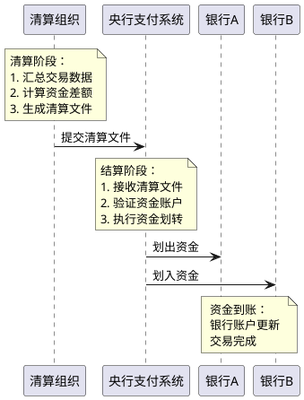
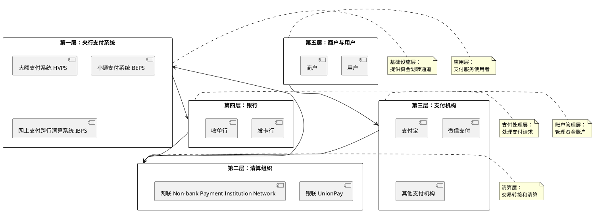
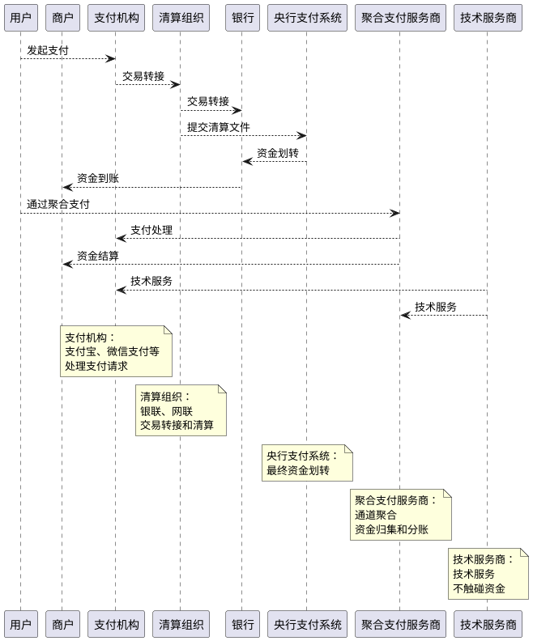
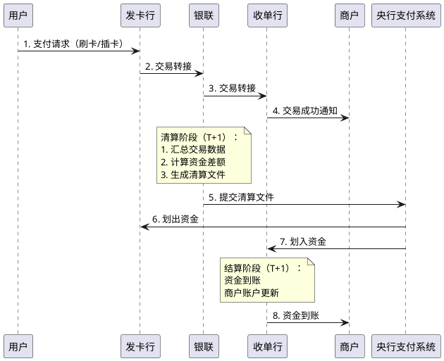
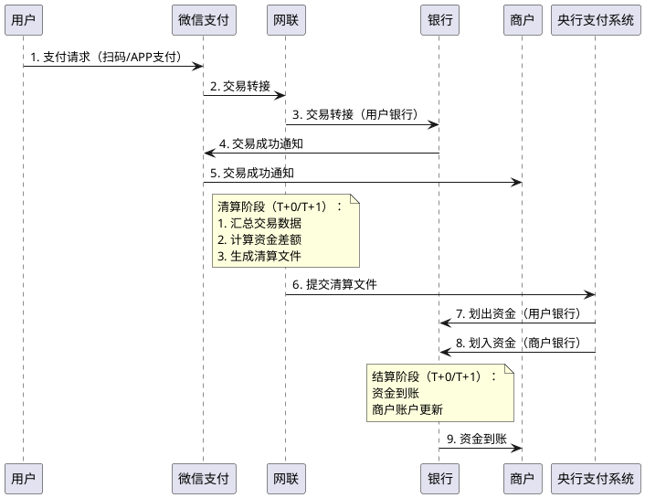
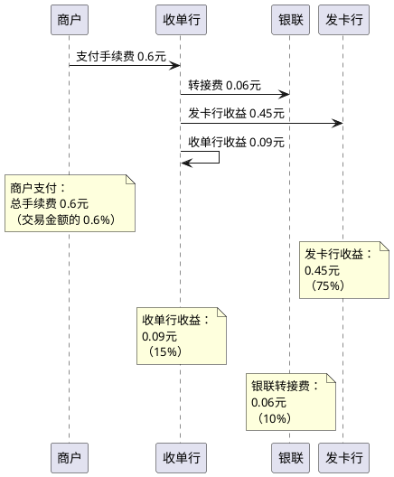
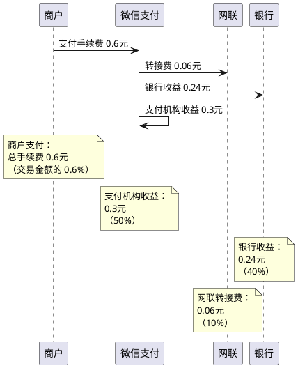

# 中国支付清算体系的完整架构

> **📖 阅读提示**：本文约 10000 字，预计阅读时间 20 分钟。建议按顺序阅读，每个概念都建立在前一个概念的基础上。本文是支付清结算系列的第八篇，建议先阅读前面的文章，特别是《中国银联的清算原理与技术架构》和《网联的清算原理与技术架构》。

## 📑 文章目录

1. [引言：从资金流转说起](#引言从资金流转说起)
2. [央行支付系统的作用](#央行支付系统的作用)
3. [支付清算体系的层级结构](#支付清算体系的层级结构)
4. [各参与者的身份定位与技术职责](#各参与者的身份定位与技术职责)
5. [资金流向的完整路径](#资金流向的完整路径)
6. [手续费分润机制](#手续费分润机制)
7. [总结与预告](#总结与预告)

---

## 引言：从资金流转说起

想象一下，你通过微信支付在餐厅消费了 100 元。这笔钱从你的银行卡账户，经过微信支付、网联、银行，最终到达餐厅的账户。整个过程涉及多个机构，每个机构都有不同的职责。

**这就是中国支付清算体系的完整架构**：从央行到商户，资金流转的每一个环节都有明确的参与者，每个参与者都有明确的身份定位和技术职责。

在前面的文章中，我们已经深入了解了：
- **银联**：负责银行卡交易的转接与清算
- **网联**：负责网络支付的转接与清算
- **支付机构**：支付宝、微信支付等，负责处理支付请求

但是，这些机构之间是如何协作的？资金最终是如何划转的？**央行支付系统**在整个体系中扮演什么角色？

**本文将从整体架构的角度，全面解析中国支付清算体系的完整架构**，帮助读者理解：
1. 央行支付系统的作用与组成
2. 支付清算体系的五层架构
3. 各参与者的身份定位与技术职责
4. 资金流转的完整路径
5. 手续费分润机制

---

## 央行支付系统的作用

### 央行支付系统的定位

**央行支付系统（Central Bank Payment System）** 是中国人民银行建设和运营的支付清算基础设施，负责银行之间的资金划转，是支付清算体系的最终结算机构。

通俗来说，央行支付系统就像银行之间的"总账房"。所有银行之间的资金划转，最终都要通过央行支付系统完成。就像公司之间的转账，最终都要通过银行系统一样。

**为什么需要央行支付系统？**

在支付清算体系中，清算组织（银联、网联）负责汇总交易、计算资金差额，但实际的资金划转，必须通过央行支付系统完成。这是因为：

1. **最终结算机构**：央行是唯一的最终结算机构，所有银行都在央行开立账户
2. **资金安全保障**：央行支付系统具有最高的安全性和可靠性
3. **监管需要**：央行需要掌握所有资金流转情况，进行监管和风险控制

**央行支付系统与清算组织的关系**：

- **清算组织**（银联、网联）：负责交易转接和清算，计算各银行之间的资金差额
- **央行支付系统**：负责最终的资金划转，将资金从一家银行划转到另一家银行

就像快递公司负责汇总包裹、计算运费，但最终的运输还是要通过物流网络一样。

### 央行支付系统的组成

央行支付系统由三个核心系统组成：

#### 1. 大额支付系统（HVPS）

**大额支付系统（High Value Payment System，HVPS）** 是央行支付系统的核心，负责银行之间的大额资金划转。

通俗来说，大额支付系统就像银行之间的"高速公路"，专门处理大额、紧急的资金划转。就像快递公司的"加急专线"，专门处理重要包裹。

**特点**：
- **实时到账**：资金实时划转，立即到账
- **大额优先**：优先处理大额交易
- **工作日运行**：在工作日运行，节假日不运行
- **单笔限额**：没有单笔限额，可以处理任意金额

**应用场景**：
- 银行之间的资金划转
- 清算组织的资金结算
- 企业大额转账
- 证券交易的资金划转

#### 2. 小额支付系统（BEPS）

**小额支付系统（Bulk Electronic Payment System，BEPS）** 是央行支付系统的补充，负责银行之间的小额、批量资金划转。

通俗来说，小额支付系统就像银行之间的"普通公路"，专门处理小额、批量的资金划转。就像快递公司的"普通快递"，批量处理普通包裹。

**特点**：
- **批量处理**：可以批量处理大量小额交易
- **成本较低**：处理成本较低，适合小额交易
- **工作日运行**：在工作日运行，节假日不运行
- **单笔限额**：单笔限额较低，适合小额交易

**应用场景**：
- 银行之间的小额资金划转
- 批量代发工资
- 批量代扣费用
- 小额跨行转账

#### 3. 网上支付跨行清算系统（IBPS）

**网上支付跨行清算系统（Internet Banking Payment System，IBPS）** 是央行支付系统的创新，负责网上支付的跨行清算。

通俗来说，网上支付跨行清算系统就像银行之间的"互联网通道"，专门处理网上支付的跨行清算。就像快递公司的"电商专线"，专门处理电商包裹。

**特点**：
- **7×24 小时运行**：全天候运行，不受工作日限制
- **实时到账**：资金实时划转，立即到账
- **小额为主**：主要处理小额交易
- **互联网接入**：通过互联网接入，方便快捷

**应用场景**：
- 网上银行跨行转账
- 第三方支付的资金划转
- 移动支付的资金划转
- 小额实时支付

### 央行支付系统与清算组织的关系

**清算组织（银联、网联）** 和 **央行支付系统** 是支付清算体系中的两个关键环节，它们的关系如下：

**工作流程**：

1. **清算阶段**（清算组织）：
   - 银联/网联汇总所有交易数据
   - 计算各银行之间的资金差额
   - 生成清算文件，提交给央行支付系统

2. **结算阶段**（央行支付系统）：
   - 央行支付系统接收清算文件
   - 验证各银行的资金账户
   - 通过大额支付系统执行资金划转

3. **资金到账**（银行）：
   - 银行账户更新
   - 交易完成

**关键点**：
- **清算组织**：负责"算账"，计算谁该给谁多少钱
- **央行支付系统**：负责"转账"，实际把钱转过去
- **银行**：负责"记账"，更新账户余额

---

## 支付清算体系的层级结构

中国支付清算体系采用**五层架构**，从央行到商户，每一层都有明确的职责。

### 第一层：央行支付系统

**央行支付系统**是支付清算体系的**基础设施层**，负责银行之间的资金划转。

**组成**：
- 大额支付系统（HVPS）
- 小额支付系统（BEPS）
- 网上支付跨行清算系统（IBPS）

**职责**：
- 提供银行之间的资金划转通道
- 保障支付系统的安全稳定
- 进行监管和风险控制

**特点**：
- 最终结算机构
- 最高安全性和可靠性
- 监管和风险控制

### 第二层：清算组织

**清算组织**是支付清算体系的**清算层**，负责交易转接和清算。

**组成**：
- **银联（UnionPay）**：负责银行卡交易的转接与清算
- **网联（Non-bank Payment Institution Network）**：负责网络支付的转接与清算

**职责**：
- 交易转接：将交易请求转发到正确的银行
- 数据汇总：汇总所有交易数据
- 资金清算：计算各银行之间的资金差额
- 提交清算文件：将清算文件提交给央行支付系统

**特点**：
- 转接清算服务
- 统一接口和标准
- 监管透明化

### 第三层：支付机构

**支付机构**是支付清算体系的**支付处理层**，负责处理支付请求。

**组成**：
- **支付宝**：蚂蚁集团旗下的支付机构
- **微信支付**：腾讯旗下的支付机构（财付通）
- **其他支付机构**：银联商务、拉卡拉等

**职责**：
- 支付处理：处理用户的支付请求
- 账户管理：管理用户的支付账户
- 资金托管：托管用户的备付金
- 对接清算组织：通过银联或网联进行清算

**特点**：
- 持牌支付机构
- 用户界面和体验
- 支付场景和产品

### 第四层：银行

**银行**是支付清算体系的**账户管理层**，负责管理资金账户。

**组成**：
- **发卡行（Issuer Bank）**：持卡人的银行，负责发卡和管理持卡人账户
- **收单行（Acquirer Bank）**：商户的银行，负责接收商户的收款

**职责**：
- 账户管理：管理用户的银行账户
- 资金划转：执行资金划转
- 风险控制：进行风险控制和反洗钱
- 对接清算组织：通过银联或网联进行清算

**特点**：
- 资金账户的托管者
- 风险控制和合规
- 资金安全保障

### 第五层：商户与用户

**商户与用户**是支付清算体系的**应用层**，是支付服务的最终使用者。

**组成**：
- **用户**：支付发起方，使用支付服务进行消费
- **商户**：收款方，接收用户的支付

**职责**：
- 发起支付：用户发起支付请求
- 接收支付：商户接收支付资金
- 使用支付服务：使用各种支付产品和服务

**特点**：
- 支付服务的最终使用者
- 支付场景的创造者
- 支付体验的体验者

### 五层架构的关系图

**关键点**：
- **自下而上**：资金从用户流向商户，经过支付机构、清算组织、央行支付系统、银行
- **自上而下**：监管从央行到清算组织，再到支付机构和银行
- **各司其职**：每一层都有明确的职责，不越界、不重复

---

## 各参与者的身份定位与技术职责

在支付清算体系中，每个参与者都有明确的身份定位和技术职责。理解这些身份定位，有助于理解整个体系的运作机制。

### 清算组织

#### 银联（UnionPay）

**身份定位**：
- **银行卡清算组织**：负责银行卡交易的转接与清算
- **品牌建设者**：推广 UnionPay 品牌
- **标准制定者**：制定银行卡技术规范和业务规则

**技术职责**：
- **交易转接**：将交易请求从收单机构转发到发卡机构
- **交易路由**：根据 BIN 码查询路由表，确定交易路径
- **数据汇总**：汇总所有银行卡交易数据
- **资金清算**：计算各银行之间的资金差额
- **清算文件生成**：生成清算文件，提交给央行支付系统

**技术特点**：
- 支持 T+1 清算（次日清算）
- 支持实时交易转接
- 支持多种交易类型（消费、取现、转账等）

#### 网联（Non-bank Payment Institution Network）

**身份定位**：
- **网络支付清算平台**：负责网络支付的转接与清算
- **监管工具**：实现"断直连"，统一监管网络支付
- **标准化平台**：统一接口和标准，规范行业

**技术职责**：
- **交易转接**：将交易请求从支付机构转发到银行
- **数据汇总**：汇总所有网络支付交易数据
- **资金清算**：计算各银行之间的资金差额
- **清算文件生成**：生成清算文件，提交给央行支付系统
- **实时清算**：支持 7×24 小时实时清算

**技术特点**：
- 支持 T+0 清算（实时清算）
- 支持 7×24 小时运行
- 支持多种支付方式（支付宝、微信支付等）

### 支付机构

#### 支付宝

**身份定位**：
- **持牌支付机构**：拥有支付牌照，可以处理支付业务
- **支付产品提供者**：提供各种支付产品和服务
- **账户服务提供者**：提供虚拟账户服务

**技术职责**：
- **支付处理**：处理用户的支付请求
- **账户管理**：管理用户的支付宝账户
- **资金托管**：托管用户的备付金
- **对接网联**：通过网联进行资金清算
- **风险控制**：进行支付风险控制

**技术特点**：
- 支持多种支付方式（余额支付、银行卡支付、花呗等）
- 支持多种支付场景（线上、线下、移动支付等）
- 支持实时到账

#### 微信支付

**身份定位**：
- **持牌支付机构**：财付通拥有支付牌照，微信支付是财付通的产品
- **支付产品提供者**：提供各种支付产品和服务
- **生态服务提供者**：基于微信生态提供支付服务

**技术职责**：
- **支付处理**：处理用户的支付请求
- **账户管理**：管理用户的微信支付账户（零钱账户）
- **资金托管**：托管用户的备付金
- **对接网联**：通过网联进行资金清算
- **风险控制**：进行支付风险控制

**技术特点**：
- 支持多种支付方式（零钱支付、银行卡支付等）
- 支持多种支付场景（线上、线下、小程序支付等）
- 支持实时到账

### 银行

#### 发卡行（Issuer Bank）

**身份定位**：
- **持卡人的银行**：负责发卡和管理持卡人账户
- **资金账户托管者**：托管持卡人的资金账户
- **风险控制者**：进行风险控制和反洗钱

**技术职责**：
- **账户管理**：管理持卡人的银行账户
- **交易授权**：对交易进行授权验证
- **资金划转**：执行资金划转
- **对接银联/网联**：通过银联或网联进行清算
- **风险控制**：进行风险控制和反洗钱

**技术特点**：
- 支持多种账户类型（储蓄账户、信用卡账户等）
- 支持实时交易授权
- 支持风险控制和反洗钱

#### 收单行（Acquirer Bank）

**身份定位**：
- **商户的银行**：负责接收商户的收款
- **资金账户托管者**：托管商户的资金账户
- **收单服务提供者**：提供收单服务

**技术职责**：
- **账户管理**：管理商户的银行账户
- **资金接收**：接收商户的收款资金
- **资金结算**：将资金结算到商户账户
- **对接银联/网联**：通过银联或网联进行清算
- **风险控制**：进行风险控制和反洗钱

**技术特点**：
- 支持多种商户类型（线上商户、线下商户等）
- 支持实时资金结算
- 支持风险控制和反洗钱

### 聚合支付服务商

**身份定位**：
- **技术服务提供者**：提供支付技术服务
- **通道聚合者**：聚合多个支付通道
- **资金服务提供者**：提供资金归集和分账服务

**技术职责**：
- **通道聚合**：对接多个支付机构（微信、支付宝等）
- **统一接口**：提供统一的 API 接口
- **资金归集**：归集商户的资金
- **分账服务**：提供分账服务
- **资金结算**：将资金结算到商户账户

**技术特点**：
- 支持多种支付方式（微信、支付宝、银联等）
- 支持统一接口和标准
- 支持资金归集和分账

### 技术服务商

**身份定位**：
- **技术服务提供者**：提供支付技术服务，但不触碰资金
- **系统集成商**：提供系统集成服务
- **合规参与者**：通过技术服务模式合规参与支付服务

**技术职责**：
- **系统开发**：开发支付系统
- **系统集成**：集成支付系统
- **技术服务**：提供技术支持和维护
- **不触碰资金**：不代收代付，不资金归集

**技术特点**：
- 不触碰资金
- 通过持牌机构完成资金清算
- 提供技术服务和支持

### 各参与者关系图

---

## 资金流向的完整路径

理解资金流向的完整路径，是理解支付清算体系的关键。不同的支付方式，资金流转路径也不同。

### 银行卡支付的资金流转

#### 支付路径

银行卡支付的资金流转路径如下：

**流程说明**：

1. **支付阶段**（实时）：
   - 用户刷卡/插卡，发起支付请求
   - 发卡行验证交易，进行授权
   - 银联转接交易，将交易请求转发到收单行
   - 收单行处理交易，通知商户交易成功

2. **清算阶段**（T+1）：
   - 银联汇总所有交易数据
   - 计算各银行之间的资金差额
   - 生成清算文件，提交给央行支付系统

3. **结算阶段**（T+1）：
   - 央行支付系统接收清算文件
   - 通过大额支付系统执行资金划转
   - 从发卡行划出资金，划入收单行
   - 收单行将资金结算到商户账户

**时间节点**：
- **支付**：实时完成（T+0）
- **清算**：T+1（次日清算）
- **结算**：T+1（次日结算）

#### 资金在各个环节的停留时间

- **支付环节**：实时完成，资金立即从用户账户扣除
- **清算环节**：T+1，资金在清算过程中不实际划转
- **结算环节**：T+1，资金通过央行支付系统划转到商户账户

### 网络支付的资金流转（断直连后）

#### 支付路径

网络支付的资金流转路径如下（以微信支付为例）：

**流程说明**：

1. **支付阶段**（实时）：
   - 用户发起支付请求（扫码/APP支付）
   - 微信支付处理支付请求
   - 网联转接交易，将交易请求转发到用户银行
   - 用户银行验证交易，进行授权
   - 微信支付通知商户交易成功

2. **清算阶段**（T+0 或 T+1）：
   - 网联汇总所有交易数据
   - 计算各银行之间的资金差额
   - 生成清算文件，提交给央行支付系统

3. **结算阶段**（T+0 或 T+1）：
   - 央行支付系统接收清算文件
   - 通过大额支付系统或网上支付跨行清算系统执行资金划转
   - 从用户银行划出资金，划入商户银行
   - 商户银行将资金结算到商户账户

**时间节点**：
- **支付**：实时完成（T+0）
- **清算**：T+0（实时清算）或 T+1（次日清算）
- **结算**：T+0（实时结算）或 T+1（次日结算）

#### 资金在各个环节的停留时间

- **支付环节**：实时完成，资金立即从用户账户扣除
- **清算环节**：T+0 或 T+1，资金在清算过程中不实际划转
- **结算环节**：T+0 或 T+1，资金通过央行支付系统划转到商户账户

### 断直连前后的对比

#### 断直连前的资金流转

**资金流转路径**：用户 → 支付机构 → 银行（直连）→ 商户

**特点**：
- 支付机构直接与银行对接
- 资金流转路径不透明
- 央行无法完全掌握资金流向

#### 断直连后的资金流转

**资金流转路径**：用户 → 支付机构 → 网联 → 银行 → 商户

**特点**：
- 支付机构必须通过网联清算
- 资金流转路径透明
- 央行可以完全掌握资金流向

### 资金流转的关键点

**资金流转的关键点**：

1. **支付阶段**：资金从用户账户扣除，但尚未到达商户账户
2. **清算阶段**：计算资金差额，但不实际划转资金
3. **结算阶段**：通过央行支付系统，实际划转资金

**资金安全保障**：

- **备付金集中存管**：支付机构的备付金必须存放在央行指定的银行账户
- **资金监管**：央行可以实时监控所有资金流转
- **风险控制**：各参与者都有风险控制机制

---

## 手续费分润机制

在支付清算体系中，商户需要支付手续费，这些手续费会在各参与者之间进行分润。

### 手续费的基本概念

**手续费（Transaction Fee）** 是商户为使用支付服务而支付的费用，通常按照交易金额的一定比例收取。

通俗来说，手续费就像使用支付服务的"服务费"。就像使用快递服务需要支付快递费一样，使用支付服务也需要支付手续费。

**手续费的计算方式**：
- **按比例收费**：按照交易金额的一定比例收取（如 0.6%）
- **固定费用**：每笔交易收取固定费用（较少使用）
- **混合收费**：按比例收费 + 固定费用

### 银行卡支付的手续费分润

#### 收单费率

**收单费率（Acquirer Fee Rate）** 是商户支付的总费率，通常为交易金额的 0.6% 左右。

**分润比例**（以 0.6% 为例）：
- **发卡行收益**：0.45%（75%）
- **收单行收益**：0.09%（15%）
- **银联转接费**：0.06%（10%）

**分润示例**：

假设用户通过银行卡支付 100 元，收单费率为 0.6%：

- **总手续费**：100 × 0.6% = 0.6 元
- **发卡行收益**：100 × 0.45% = 0.45 元
- **收单行收益**：100 × 0.09% = 0.09 元
- **银联转接费**：100 × 0.06% = 0.06 元

**分润流程**：

### 网络支付的手续费分润

#### 收单费率

**收单费率** 是商户支付的总费率，通常为交易金额的 0.6% 左右（与银行卡支付相同）。

**分润比例**（以微信支付为例，费率为 0.6%）：
- **支付机构收益**：0.3%（50%）
- **银行收益**：0.24%（40%）
- **网联转接费**：0.06%（10%）

**分润示例**：

假设用户通过微信支付支付 100 元，收单费率为 0.6%：

- **总手续费**：100 × 0.6% = 0.6 元
- **支付机构收益**：100 × 0.3% = 0.3 元（微信支付）
- **银行收益**：100 × 0.24% = 0.24 元
- **网联转接费**：100 × 0.06% = 0.06 元

**分润流程**：

### 手续费分润的技术实现

**手续费分润的技术实现**：

1. **清算文件中的分润字段**：
   - 清算文件包含手续费分润信息
   - 各参与者的收益金额
   - 分润比例和计算方式

2. **资金划转**：
   - 手续费从商户账户扣除
   - 通过清算文件，将手续费分润到各参与者
   - 各参与者的收益通过央行支付系统划转

3. **对账机制**：
   - 各参与者对账，确认手续费分润
   - 异常处理，确保分润准确

### 手续费分润的影响因素

**手续费分润的影响因素**：

1. **交易类型**：不同交易类型，手续费分润比例不同
2. **商户类型**：不同商户类型，手续费率不同
3. **交易金额**：大额交易可能有优惠
4. **行业政策**：监管政策可能影响手续费分润

---

## 总结与预告

### 本文核心要点

通过本文，我们全面了解了**中国支付清算体系的完整架构**：

1. **央行支付系统的作用**：
   - 央行支付系统是支付清算体系的最终结算机构
   - 由大额支付系统、小额支付系统、网上支付跨行清算系统组成
   - 负责银行之间的资金划转，保障支付系统的安全稳定

2. **支付清算体系的五层架构**：
   - 第一层：央行支付系统（基础设施层）
   - 第二层：清算组织（清算层）
   - 第三层：支付机构（支付处理层）
   - 第四层：银行（账户管理层）
   - 第五层：商户与用户（应用层）

3. **各参与者的身份定位与技术职责**：
   - 清算组织：银联、网联，负责交易转接和清算
   - 支付机构：支付宝、微信支付等，负责处理支付请求
   - 银行：发卡行、收单行，负责账户管理和资金划转
   - 聚合支付服务商：通道聚合、资金归集和分账
   - 技术服务商：技术服务，不触碰资金

4. **资金流向的完整路径**：
   - 银行卡支付：用户 → 发卡行 → 银联 → 收单行 → 商户
   - 网络支付：用户 → 支付机构 → 网联 → 银行 → 商户
   - 资金在各个环节的停留时间和时效性

5. **手续费分润机制**：
   - 商户支付手续费，各参与者按比例分润
   - 银行卡支付：发卡行、收单行、银联分润
   - 网络支付：支付机构、银行、网联分润

### 关键理解

**理解支付清算体系的关键**：

1. **层级关系**：从央行到商户，每一层都有明确的职责
2. **协作机制**：各参与者通过协作，完成资金流转
3. **监管透明**：通过"断直连"，实现监管透明化
4. **资金安全**：通过备付金集中存管，保障资金安全

### 下篇预告

在下一篇文章中，我们将深入解析**微信支付的技术架构与产品体系**，包括：

- 微信支付的历史背景和发展历程
- 微信支付的产品体系（支付产品、商户产品、行业解决方案）
- 微信支付的技术架构（客户端架构、服务端架构）
- 微信支付的账户体系

这将帮助我们全面理解微信支付的完整技术体系，为后续深入理解微信支付的对接模式和清结算机制打下基础。

---

## 参考资料

- [中国人民银行支付结算司](http://www.pbc.gov.cn/)
- [中国银联官网](https://www.unionpay.com/)
- [网联清算有限公司](https://www.netsunion.com/)
- 《非金融机构支付服务管理办法》
- 《支付机构客户备付金存管办法》

---

**最后更新**：2025-11-25  
**系列文章**：中国线上支付与清结算体系深度解析  
**下一篇**：《微信支付的技术架构与产品体系》

