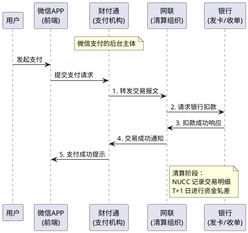
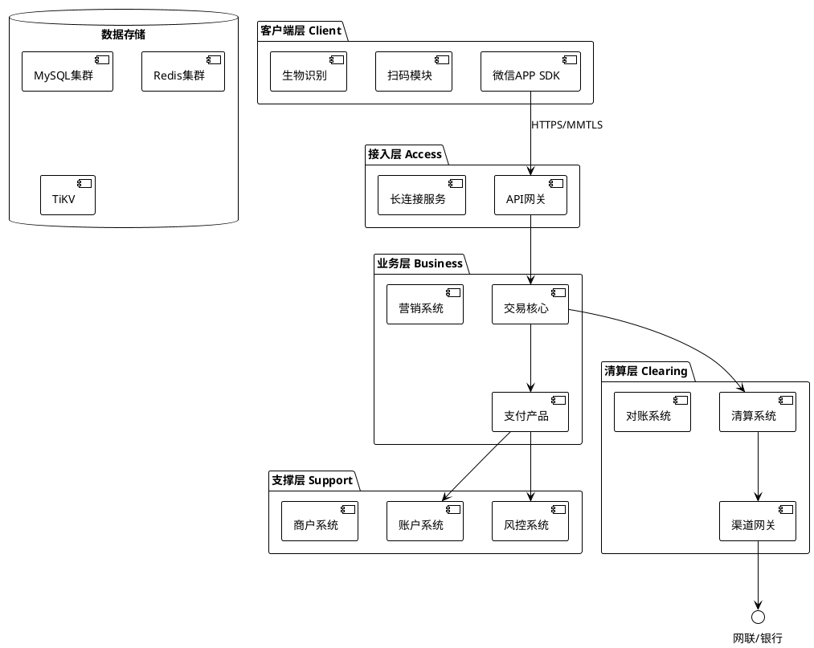
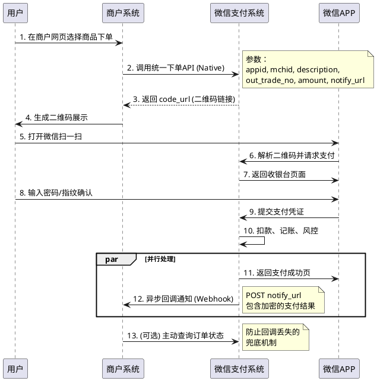

# 微信支付的技术架构与产品体系

> **📖 阅读提示**：本文约 10000 字，预计阅读时间 20 分钟。建议先阅读前序文章[《网联的清算原理与技术架构》](/posts/2025-11-24-网联的清算原理与技术架构)以了解网络支付清算的基础背景。

## 📑 文章目录

1. [引言：从一个红包说起](#引言从一个红包说起)
2. [微信支付的诞生与发展](#微信支付的诞生与发展)
3. [微信支付的定位与角色](#微信支付的定位与角色)
4. [微信支付的产品体系](#微信支付的产品体系)
5. [微信支付的技术架构](#微信支付的技术架构)
6. [核心技术实现](#核心技术实现)
7. [总结与预告](#总结与预告)

---

## 一、引言：从一个红包说起

还记得 2014 年那个除夕夜吗？

当一家人围坐在电视机前看春晚时，突然有人喊了一句："快抢红包！" 瞬间，无论老少，都低头盯着手机屏幕，疯狂点击那个红色的信封。那一夜，**微信红包** 横空出世，不仅让数亿用户绑定了银行卡，更是一举奠定了微信支付在移动支付领域的江湖地位。

马云曾将这次"珍珠港偷袭"形容为对支付宝的巨大冲击。

但你是否想过，当你点击"开"的那一瞬间，由于数亿人同时操作，后台发生了什么？
*   你的钱是怎么从银行卡进到微信零钱的？
*   微信支付和财付通是什么关系？
*   它和支付宝在技术架构上有什么区别？

在前几篇文章中，我们已经深入探讨了**支付、清算、结算**的本质，理解了**银联**和**网联**的运作机制。今天，我们将目光聚焦于这个国民级的支付工具——**微信支付**，深入剖析它的技术架构与产品体系。

---

## 二、微信支付的诞生与发展

### 2.1 财付通：微信支付的幕后英雄

在讲微信支付之前，必须先提到它的"父亲"——**财付通（Tenpay）**。

早在 2005 年，腾讯为了对标支付宝，成立了财付通。当时的财付通主要服务于腾讯内部的生态，比如 QQ 钱包充值 Q 币、购买游戏道具，以及拍拍网的电商交易。

虽然财付通在 PC 时代一直不温不火，但它积累了两样至关重要的东西：
1.  **支付牌照**：2011 年，财付通获得了央行颁发的首批《支付业务许可证》。
2.  **技术积累**：积累了处理高并发交易、资金清结算的底层技术能力。

### 2.2 微信支付的崛起之路

**2013 年：微信支付上线**  
随着微信 5.0 版本的发布，微信支付正式亮相。最初，它只是微信生态内的一个功能，用户可以将银行卡绑定到微信，实现应用内支付。

**2014 年：春节红包的爆发**  
这是一个载入支付史册的时刻。微信推出了"微信红包"，利用社交裂变效应，让用户主动绑定银行卡。短短几天内，微信支付绑卡用户量实现了过亿的增长，完成了支付宝走了 8 年的路。

**2015 年：全面进军线下**  
微信支付开始大力推广**二维码支付**，从便利店到路边摊，绿色的收款码迅速铺遍了大街小巷。

**2017 年：小程序支付上线**  
随着小程序的推出，微信支付完成了"用完即走"的商业闭环，进一步巩固了生态优势。

### 2.3 为什么微信支付能成功？

1.  **高频打低频**：微信作为社交软件，是绝对的"高频"应用，而支付通常是"低频"行为。在微信里顺便付款，比专门打开一个钱包软件要自然得多。
2.  **社交属性**：红包、转账等功能天然带有社交属性，极大地降低了用户门槛。
3.  **极致体验**：从扫码到支付成功，整个过程行云流水，二维码技术的普及功不可没。

---

## 三、微信支付的定位与角色

在深入技术之前，我们需要厘清微信支付在整个支付清算体系中的法律地位和角色。

### 3.1 法律主体与牌照

严格来说，**"微信支付"只是一个产品名称，而非公司名称。**

*   **运营主体**：财付通支付科技有限公司。
*   **法律地位**：持牌第三方支付机构（Non-bank Payment Institution）。
*   **监管归属**：受中国人民银行（央行）监管。

当你使用微信支付时，用户协议是与**财付通**签署的。微信 App 只是一个前端入口，底层的资金处理、风控、清算都是由财付通完成的。

### 3.2 资金流转架构

在"断直连"政策实施后，微信支付的资金流转路径发生了根本性变化。



**角色详解**：

*   **微信 App**：支付指令的采集端，负责用户交互、密码输入、生物识别。
*   **财付通**：**支付机构**。负责账户管理、交易逻辑处理、风控拦截。
*   **网联**：**清算组织**。负责微信支付与各家银行之间的交易转接和清算，是资金流动的"交通枢纽"。
*   **银行**：**资金托管方**。用户的钱实际是从银行卡扣除，或者存放在银行的备付金账户中。

---

## 四、微信支付的产品体系

微信支付不仅仅是一个"付款"功能，它是一套庞大的产品矩阵，涵盖了线上、线下各种场景。

### 4.1 支付产品矩阵

微信支付根据不同的交互场景，提供了多种支付方式。理解这些模式的区别，是进行系统对接的基础。

#### 1. 付款码支付（被扫）

*   **场景**：你在便利店买水，出示微信右上角的"收付款"二维码，店员用扫码枪扫你。
*   **特点**：**B 扫 C**（Business scan Customer）。
*   **技术流**：用户展示动态条码 -> 商户扫码 -> 商户系统请求微信支付 -> 扣款。
*   **优势**：速度极快，通常免密（小额）。

#### 2. JSAPI 支付 / 小程序支付

*   **场景**：你在微信里的"京东购物"小程序买东西，或者在微信公众号里买课。
*   **特点**：**在微信内部环境**唤起支付收银台。
*   **技术流**：商户调用微信 JSSDK -> 弹出微信支付密码框 -> 用户输入密码。
*   **核心**：依赖 `openid`（用户在商户下的唯一标识）。

#### 3. Native 支付（主扫）

*   **场景**：你在自动售货机屏幕上看到一个二维码，或者在 PC 网页上购物看到一个二维码，掏出手机微信扫一扫。
*   **特点**：**C 扫 B**（Customer scan Business）。
*   **技术流**：商户调用统一下单接口 -> 获取 `code_url` -> 生成二维码 -> 用户扫码。

#### 4. APP 支付

*   **场景**：你在"美团" App（非微信环境）里下单，选择"微信支付"，自动跳转到微信 App 完成付款。
*   **特点**：**跨应用跳转**。
*   **技术流**：商户 App 调用微信 SDK -> 唤起微信 App -> 完成支付 -> 跳回商户 App。

#### 5. H5 支付

*   **场景**：你在手机浏览器（如 Safari、Chrome）里浏览网页，点击购买，跳转到微信支付。
*   **特点**：**移动端网页跳转**。
*   **技术流**：利用 Deep Link 技术唤起微信。

### 4.2 商户体系

微信支付的商户体系设计非常灵活，支持直连和间连两种模式。

| 模式 | 描述 | 适用对象 | 资金流向 |
| :--- | :--- | :--- | :--- |
| **普通商户（直连）** | 商户直接向微信支付申请入驻 | 有技术能力的单一企业 | 用户 -> 微信 -> 商户 |
| **服务商（间连）** | 服务商（ISV）帮助子商户接入 | 连锁店、SaaS 平台、无开发能力的小微商户 | 用户 -> 微信 -> 子商户 |
| **银行服务商** | 银行作为服务商角色 | 银行合作的商户 | 用户 -> 微信 -> 银行 -> 商户 |

> **💡 提示**：**服务商模式**是微信支付生态繁荣的关键。服务商（如收钱吧、微盟）只提供技术服务和市场拓展，**不触碰资金**。资金直接清算给子商户，这符合央行的"二清"监管要求。

---

## 五、微信支付的技术架构

微信支付作为支撑亿级并发的金融级系统，其技术架构具有极高的可用性、一致性和安全性。我们将从客户端和服务端两个视角来解析。

### 5.1 整体架构概览



### 5.2 关键模块解析

#### 1. API 网关与安全接入

微信支付的入口不仅仅是普通的 HTTPS，它采用了一套名为 **MMTLS**（WeChat Transport Layer Security）的私有加密协议。

*   **作用**：防止中间人攻击、防止数据被抓包篡改。
*   **机制**：基于 TLS 1.3 改良，实现了 0-RTT（零往返时间）握手，在保证安全的同时极大提升了弱网环境下的连接速度。这也就是为什么你在地铁信号不好时，微信支付依然比其他应用更流畅的原因之一。

#### 2. 交易核心系统

这是心脏部位，负责处理每一笔支付请求。

*   **状态机管理**：支付是一系列复杂状态的流转（已创建 -> 支付中 -> 成功/失败 -> 已退款）。交易系统维护着这个状态机，确保状态流转的原子性。
*   **幂等性控制**：**幂等（Idempotence）** 是支付系统的基石。即同一个请求无论发送多少次，结果都是一样的。
    *   微信支付要求商户提供 `out_trade_no`（商户订单号），并以此作为幂等键。如果由于网络超时，商户重试了同一笔订单，微信支付会检测到订单已存在，直接返回当前状态，而不会重复扣款。

#### 3. 账户系统（Hot Account 问题）

微信支付维护着数十亿个账户（用户零钱账户、商户结算账户）。这里面临的一个巨大挑战是 **热点账户（Hot Account）** 问题。

*   **场景**：除夕夜，几亿人同时给某几个明星或大 V 发红包；或者双十一，海量用户向同一个大商户付款。
*   **挑战**：数据库的行锁机制会导致高并发下的串行等待，性能急剧下降。
*   **解决方案**：
    *   **入账缓冲**：先将高并发的入账请求写入内存队列或 Redis，异步批量更新数据库。
    *   **子账户拆分**：将一个大商户账户拆分成多个影子子账户，随机写入，最后再汇总。

#### 4. 风控系统

在支付发生的毫秒级时间内，风控系统要完成数百项检查：
*   这笔交易是否符合用户的历史习惯？
*   设备是否有越狱或中毒风险？
*   收款方是否是欺诈黑名单？
*   地理位置是否发生突变（上一笔在北京，下一笔在纽约）？

如果判定风险极高，交易会被直接拦截；如果风险可疑，会触发二次验证（如人脸识别或输入完整身份证号）。

---

## 六、核心技术实现

对于开发者来说，理解微信支付的 API 设计和交互流程是接入的关键。

### 6.1 API 设计演进

微信支付的 API 经历了从 XML 到 JSON 的演进。

*   **V2 版本**：采用 **XML** 格式传输数据，使用 **MD5** 签名。这是最经典的版本，目前仍有大量旧系统在使用。
*   **V3 版本**：全面拥抱 **RESTful** 风格，使用 **JSON** 格式，采用 **AES-256-GCM** 加密和 **RSA** 签名。

**V3 版本的优势**：
1.  **更安全**：基于证书的非对称加密，解决了密钥在传输中泄露的风险。
2.  **更标准**：符合现代 API 设计规范，HTTP 状态码语义清晰（200 成功，4xx 客户端错误，5xx 服务端错误）。

### 6.2 支付流程的时序图（以 Native 扫码支付为例）

这是一个典型的**异步交互**流程。



### 6.3 安全机制：签名与验签

**签名（Signature）** 是为了证明"我是我"以及"数据没有被篡改"。

**1. 商户请求微信（签名）**：
商户用自己的**商户私钥**对请求报文进行签名。微信支付收到后，用商户上传的**公钥**验签。如果验签成功，说明请求确实来自该商户，且数据未被修改。

**2. 微信回调商户（验签）**：
微信支付用**微信平台私钥**对回调报文签名。商户收到后，用**微信平台公钥**验签。这步至关重要，**千万不要只看 body 里的状态就发货，必须验证签名！** 否则黑客可以伪造一个"支付成功"的通知发给你，骗取商品。

```java
// 伪代码：微信支付 V3 验签逻辑
public boolean verifySignature(String signature, String body, String nonce, String timestamp) {
    // 1. 构造验签名串
    String message = timestamp + "\n" + nonce + "\n" + body + "\n";
    
    // 2. 获取微信平台公钥
    PublicKey wechatPublicKey = getWechatPublicKey();
    
    // 3. 使用 RSA 算法验证签名
    return RSA.verify(message, signature, wechatPublicKey);
}
```

### 6.4 回调通知与最佳实践

**回调通知（Callback Notification）** 是支付系统中最容易出问题的环节。

**必须遵守的铁律**：
1.  **幂等处理**：微信可能会多次发送同一个通知（例如商户服务器响应慢）。商户必须保证处理逻辑是幂等的，不能重复发货。
2.  **主动查询兜底**：**永远不要完全依赖回调**。网络是不可靠的，回调可能会丢失。商户系统必须有一个定时任务，对于长时间未收到回调的订单，主动调用微信的查询接口核实状态。
3.  **快速响应**：收到回调后，先将数据写入数据库或消息队列，立即返回 HTTP 200 给微信，然后再进行复杂的业务逻辑处理。否则微信会认为超时而重试。

---

## 七、总结与预告

### 7.1 核心要点回顾

1.  **产品体系**：微信支付构建了从 B 扫 C 到 C 扫 B，从 APP 到小程序的完整支付场景覆盖。
2.  **角色定位**：财付通作为持牌机构处理业务，网联作为枢纽处理清算，银行负责资金托管。
3.  **技术架构**：基于 MMTLS 的安全接入、幂等的交易处理、高并发的账户系统以及实时的风控引擎，共同构筑了金融级的稳定性。
4.  **开发核心**：理解**异步通知**、**签名验签**和**状态机**是接入微信支付的三大基本功。

### 7.2 预告

理解了微信支付的技术架构后，你可能会问：如果是做一个像"有赞"或"微盟"这样的平台，要帮成千上万个商家接入微信支付，该怎么做？每个商家都要去申请一个商户号吗？

这就要用到微信支付最强大的**服务商模式**。

在下一篇文章[《微信支付的对接模式深度解析》](/posts/2025-11-27-微信支付的对接模式深度解析)中，我们将深入探讨：
*   普通商户模式 vs 服务商模式的技术差异。
*   如何设计一个支持多级商户的支付系统？
*   分账功能是如何解决平台抽成难题的？

敬请期待！

---

