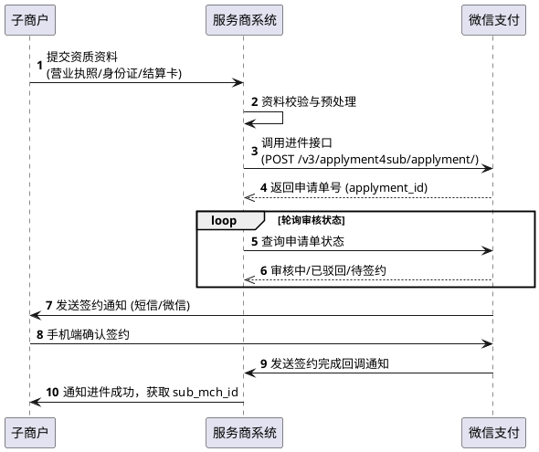
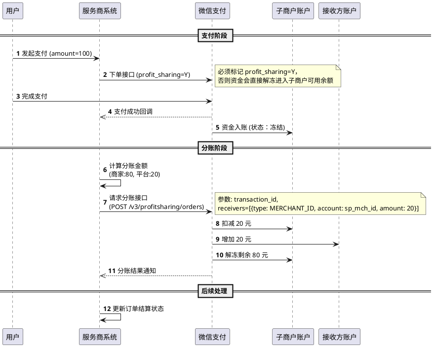

# 微信支付的对接模式深度解析

> **📖 阅读提示**：本文约 10000 字，预计阅读时间 20 分钟。建议先阅读前一篇《微信支付的技术架构与产品体系》，以便更好地理解本文内容。

## 📑 文章目录

1. [引言：从"开店"说起](#引言从开店说起)
2. [微信支付的三种对接模式](#微信支付的三种对接模式)
3. [服务商模式深度解析](#服务商模式深度解析)
4. [分账功能的技术实现](#分账功能的技术实现)
5. [资金流转与清算逻辑](#资金流转与清算逻辑)
6. [总结与预告](#总结与预告)

---

## 一、引言：从"开店"说起

在上一篇文章中，我们深入探讨了微信支付的技术架构和产品体系，了解了它如何支撑海量的并发交易。但是，对于一个想要接入微信支付的企业来说，仅仅了解架构是不够的。你面临的第一个实际问题是：**我该以什么身份接入？**

想象一下，你想在现实生活中做生意，有几种方式：

1.  **独立开店**：你在路边租个门面，自己办营业执照，自己收银，钱直接进你的口袋。
2.  **入驻商场**：你租用商场的一个铺位，商场统一收银，然后定期把钱结算给你，商场可能会抽取一部分管理费。
3.  **银行合作**：你找银行帮你收款，银行提供全套服务，钱进银行账户，再转给你。

在微信支付的世界里，这三种方式分别对应了三种核心的对接模式：**直连模式**、**服务商模式**和**银行服务商模式**。

选择哪种模式，不仅决定了你的**技术对接方式**（API 怎么调），还直接决定了你的**资金流向**（钱怎么走）和**业务合规性**（是否合法）。

本篇文章，我们将深入这三种模式的技术肌理，特别是目前互联网平台最常用的**服务商模式**，剖析其背后的`sub_mch_id`机制、分账逻辑以及复杂的资金流转路径。

---

## 二、微信支付的三种对接模式

### 1. 直连模式（普通商户）

**直连模式（Direct Connection Mode）** 是最基础、最常见的对接方式。

*   **通俗解释**：就像"独立开店"。商户自己去微信支付官网申请商户号，自己开发系统对接微信支付 API。
*   **适用场景**：个体工商户、企业、品牌商（如京东、唯品会）等拥有独立收款需求的实体。
*   **核心特征**：
    *   **商户号**：拥有独立的商户号（`mch_id`）。
    *   **资金流**：用户支付 -> 微信支付 -> 商户结算账户。
    *   **API 交互**：商户系统直接使用自己的 API 密钥（API v3 Key）对请求进行签名，与微信支付服务器通信。

### 2. 服务商模式

**服务商模式（Service Provider Mode）** 是为了解决"平台型"业务需求而诞生的。

*   **通俗解释**：就像"开商场"。服务商（Platform）是一个大管家，它帮助下面的成千上万个子商户（Sub-merchant）接入微信支付。
*   **适用场景**：
    *   **SaaS 服务商**：如微盟、有赞，为商家提供开店系统和支付功能。
    *   **电商平台**：多商户入驻的商城系统。
    *   **连锁品牌**：总店管理分店的收银。
*   **核心特征**：
    *   **双重身份**：请求中必须同时包含 **服务商商户号（`sp_mch_id`）** 和 **子商户商户号（`sub_mch_id`）**。
    *   **代发起**：服务商代表子商户发起支付请求。
    *   **资金流**：用户支付 -> 微信支付 -> **子商户**结算账户（服务商通常不碰子商户的本金，除非涉及分账）。
    *   **盈利模式**：服务商可以通过技术服务费或官方返佣（微信支付给服务商的奖励）获利。

> **💡 关键点**：在服务商模式下，资金是**直接**进入子商户账户的，**不是**先到服务商账户再转给子商户。这避免了"二清"（二次清算）的合规风险。

### 3. 银行服务商模式

**银行服务商模式（Bank Service Provider Mode）** 是服务商模式的一个变种。

*   **通俗解释**：就像"银行开的商场"。角色和服务商模式类似，但服务商的主体是**银行**或其他持牌金融机构。
*   **适用场景**：银行拓展的线下商户、聚合支付场景。
*   **核心区别**：
    *   **资金存管**：资金可能在银行侧进行更复杂的处理。
    *   **费率优势**：银行通常能拿到更低的官方费率。

### 三种模式的技术对比

| 维度 | 直连模式 | 服务商模式 | 银行服务商模式 |
| :--- | :--- | :--- | :--- |
| **商户号数量** | 单个 `mch_id` | 双号：`sp_mch_id` + `sub_mch_id` | 双号：`sp_mch_id` + `sub_mch_id` |
| **API 调用** | 直接调用 | 需传入 `sub_mch_id` | 需传入 `sub_mch_id` |
| **密钥管理** | 商户自己管理 | 服务商统一管理签名，子商户无需开发 | 银行统一管理 |
| **资金流向** | 直达商户 | 直达子商户（支持分账） | 直达子商户（支持分账） |
| **开发难度** | 低 | 高（需处理子商户进件、授权等） | 高 |
| **适用对象** | 自营业务 | 平台、SaaS、软件开发商 | 银行、支付机构 |

---

## 三、服务商模式深度解析

服务商模式是互联网平台开发中最常遇到的场景，也是技术逻辑最复杂的模式。我们从**子商户入驻（进件）**和**支付流程**两个核心环节来深入解析。

### 1. 进件：子商户如何入驻？

在直连模式下，商户需要在微信支付官网手动填写资料。而在服务商模式下，服务商可以通过 API 帮子商户提交资料，这个过程称为**进件（Onboarding）**。

**进件流程图**：



**技术要点**：
1.  **敏感信息加密**：进件接口中包含身份证、银行卡等敏感信息。微信支付 API v3 要求对这些字段使用**微信支付公钥**进行加密（RSA-OAEP 算法），并在 HTTP 头中设置 `Wechatpay-Serial`。
2.  **图片上传**：营业执照等图片需要先调用图片上传接口，获取 `media_id`，再在进件接口中使用。
3.  **签约状态**：进件审核通过后，必须由子商户法人在手机端完成签约（确认费率和协议），`sub_mch_id` 才能正常收款。

### 2. 支付：sub_mch_id 的魔力

服务商模式下的支付接口调用，与直连模式最大的区别在于：**必须携带子商户号**。

以 **JSAPI 下单接口** 为例：

**直连模式请求体**：
```json
{
  "mch_id": "1900006001",  // 直连商户号
  "out_trade_no": "1217752501201407033233368018",
  "appid": "wxd678efh567hg6787",
  "description": "Image形象店-深圳腾大-QQ公仔",
  "notify_url": "https://www.weixin.qq.com/wxpay/pay.php",
  "amount": { "total": 100, "currency": "CNY" },
  "payer": { "openid": "oUpF8uMuAJO_M2pxb1Q9zNjWeS6o" }
}
```

**服务商模式请求体**：
```json
{
  "sp_mch_id": "1900006511",  // 服务商商户号
  "sp_appid": "wxd678efh567hg6787", // 服务商 AppID
  "sub_mch_id": "1900006622", // 【关键差异】子商户商户号
  // sub_appid: "..." // 可选，如果有子商户独立的小程序 AppID
  "out_trade_no": "1217752501201407033233368018",
  "description": "Image形象店-深圳腾大-QQ公仔",
  "notify_url": "https://www.weixin.qq.com/wxpay/pay.php",
  "amount": { "total": 100, "currency": "CNY" },
  "payer": {
    "sp_openid": "oUpF8uMuAJO_M2pxb1Q9zNjWeS6o" // 用户在服务商 AppID 下的 OpenID
    // 或 "sub_openid": "..." // 用户在子商户 AppID 下的 OpenID（二选一）
  }
}
```

**技术细节**：
*   **OpenID 的选择**：如果用户是在服务商的小程序（如外卖平台小程序）下单，传 `sp_openid`；如果是在商家自己的小程序（如某品牌官方小程序，但由服务商代开发）下单，传 `sub_openid`。
*   **回调通知**：支付成功的回调通知会发送给**服务商**配置的 `notify_url`。服务商接收后，需要根据 `sub_mch_id` 找到对应的子商户业务逻辑进行处理。

---

## 四、分账功能的技术实现

服务商模式解决的最核心痛点之一是：**资金分配**。

**场景**：一个外卖平台（服务商），用户支付了 100 元（含 20 元菜品费 + 5 元配送费 + 平台抽成）。这 100 元如果全给商家，平台怎么收配送费和抽成？如果全给平台，就构成了"二清"，违法。

**解决方案**：**微信支付分账（Profit Sharing）**。

### 1. 分账的原理

**分账（Profit Sharing）** 是指在用户支付成功后，微信支付先把资金**冻结**，不直接结算给子商户。服务商通过 API 发起分账指令，告诉微信支付："把这笔钱的 80 元给商家，20 元给平台（或者配送员）"。

*   **默认分账比例**：最高 30%。即一笔订单最多可以把 30% 的资金分给其他人，剩余 70% 必须留给子商户。
*   **分账接收方**：可以是商户号（分给其他公司），也可以是个人微信号（分给员工、配送员）。

### 2. 分账流程时序图



### 3. 关键技术实现

#### A. 标记分账订单
在调用统一下单接口时，必须设置 `profit_sharing` 字段为 `true`（或 `Y`）。如果不设置，支付成功后资金会按照 T+1 周期自动结算给子商户，无法再进行分账。

#### B. 添加分账接收方
在发起分账前，必须先调用 **添加分账接收方接口**，建立子商户与接收方的绑定关系。这是为了防止服务商随意把子商户的钱分给无关人员，保障资金安全。

```java
// 伪代码：添加分账接收方
HttpPost request = new HttpPost("https://api.mch.weixin.qq.com/v3/profitsharing/receivers/add");
String json = "{"
  + "\"sub_mch_id\": \"1900006622\","
  + "\"type\": \"MERCHANT_ID\","
  + "\"account\": \"1900006511\"," // 分给服务商自己
  + "\"relation_type\": \"SERVICE_PROVIDER\"" // 关系：服务商
  + "}";
// ... 签名并发送请求 ...
```

#### C. 请求分账
分账是**异步**的。调用分账接口后，微信支付会返回一个中间状态（PROCESSING）。服务商需要通过查询接口或监听回调来确认分账最终是否成功。

#### D. 完结分账
如果一笔订单不需要分账，或者分账已经完成（且没分完所有的钱，剩余的要给商户），必须调用 **完结分账接口**。这一步非常关键，它会触发**剩余资金的解冻**。如果不调用，子商户的这笔钱会一直冻结，无法提现。

> **⚠️ 警告**：严禁利用分账功能进行违规资金清算，例如帮赌博网站洗钱。微信支付风控系统会实时监控分账行为，一旦发现异常（如高频对个人分账、分账比例异常），会直接封禁商户号。

---

## 五、资金流转与清算逻辑

理解了业务流程，我们再潜入水下，看看底层的**资金流转（Fund Flow）**是如何在银行和清算组织之间发生的。这对于排查"钱去哪了"的问题至关重要。

### 1. 资金流转路径（服务商模式）

在“断直连”政策实施后，微信支付（作为第三方支付机构）必须通过**网联（NetsUnion）**进行跨行清算。

**资金流向图**：

```mermaid
graph LR
    User[用户银行卡] -->|支付指令| WeChat[微信支付]
    WeChat -->|清算请求| NU[网联清算平台]
    NU -->|扣款指令| UserBank[发卡行]
    
    subgraph 资金归集
    UserBank --|实际资金| ACS[央行备付金账户]
    end
    
    subgraph 资金结算
    ACS --|T+1 结算| SubBank[子商户银行账户]
    end
```

**详细步骤**：

1.  **支付（T日）**：
    *   用户付款，资金并没有直接进商家的口袋，而是从用户的银行卡扣除，进入了**微信支付在央行的备付金集中存管账户**。
    *   此时，微信支付系统内，子商户的账户余额增加（逻辑上的钱），但还在冻结状态（如果是分账订单）。

2.  **清算（T日晚）**：
    *   微信支付将当天的交易数据汇总，生成清算文件，上传给网联。
    *   网联进行轧差计算，算出各家银行应收应付的金额。

3.  **结算（T+1日）**：
    *   **资金划拨**：央行根据网联的指令，将资金从备付金账户划拨到子商户绑定的银行结算账户。
    *   **分账资金**：如果执行了分账，相应的资金会划拨到分账接收方（如服务商）的银行账户。

### 2. 对账单中的体现

在服务商模式下，对账单分为两种：
*   **资金账单**：体现账户余额的变动，展示资金实际到了谁的账上。
*   **交易账单**：体现业务交易明细。

服务商可以通过 API 下载 **特约商户资金账单**。在账单中，你会看到类似这样的记录：

| 记账时间 | 业务类型 | 收入/支出 | 金额 | 备注 |
| :--- | :--- | :--- | :--- | :--- |
| 2025-11-27 10:00 | 交易 | 收入 | +100.00 | 订单收款 |
| 2025-11-27 10:05 | 分账 | 支出 | -20.00 | 分给服务商 |
| 2025-11-27 10:05 | 交易手续费 | 支出 | -0.60 | 微信收取0.6% |

注意，手续费通常是从**子商户**的结算金额中扣除的。

---

## 六、总结与预告

微信支付的对接模式选择，本质上是在权衡**业务灵活性**与**开发复杂度**。

*   **直连模式**适合"单打独斗"，简单直接。
*   **服务商模式**是"平台思维"的产物，通过 `sub_mch_id` 和分账机制，完美解决了平台型业务的资金合规与分配问题。它不仅是一个支付接口，更是一套商业分润的底层基础设施。

理解了服务商模式，你就理解了美团、拼多多、有赞等巨头背后的支付逻辑。

**💡 思考题**：
在服务商模式下，如果发生退款，分出去的钱（比如分给骑手的 5 元）该怎么退？是必须先让骑手退回来，还是可以直接从商户余额扣？

这涉及到**分账回退**的复杂逻辑。而在这一切的背后，支撑着每天十亿级交易量稳定运行的，是微信支付强大的**清结算系统**。

下一篇，我们将深入**微信支付的清结算机制**，揭秘 T+1 结算、日切、轧差以及异常资金处理的黑盒世界。敬请期待！

---

