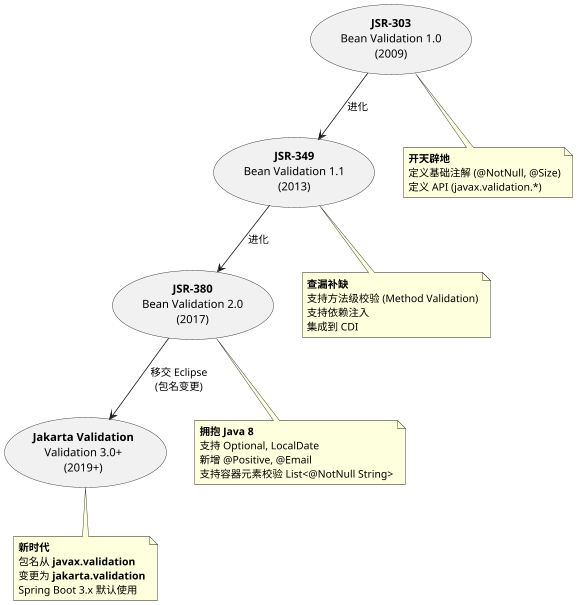
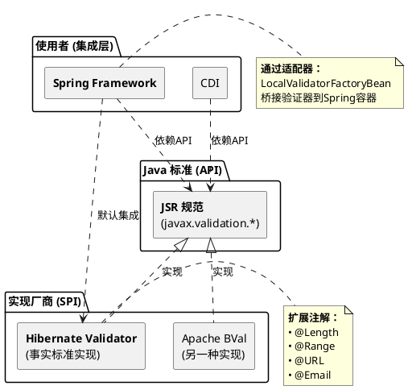
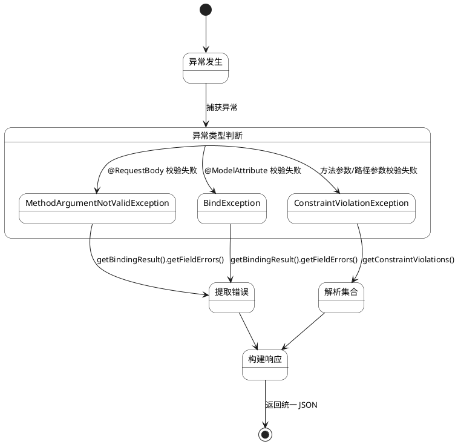
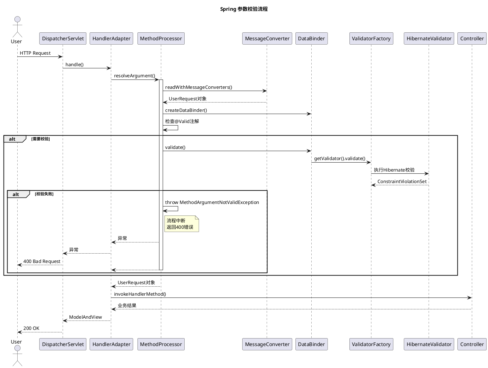
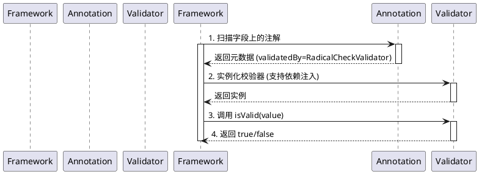

# Java 数据校验全景指南

## 第一部分：校验框架的前世今生

### 1. 为什么要数据校验？

#### 1.1 传统校验方式的痛点

在数据校验框架出现之前，开发者通常在业务代码中手动编写防御性逻辑。这种"硬编码"方式带来了显著的问题：

*   **代码冗余 (Redundancy)**：大量的 `if-else` 判空、长度检查充斥在 Controller、Service 甚至 DAO 层，掩盖了核心业务逻辑。
*   **逻辑分散 (Scattered Logic)**：同一个对象的校验规则（如"用户名不能为空"）散落在多个方法中，修改规则需要全盘搜索。
*   **标准不一 (Inconsistency)**：不同的开发者可能使用不同的校验风格（有的抛异常，有的返回 boolean，有的返回错误码），增加了团队协作成本。

#### 1.2 数据校验的三层防御体系

一个健壮的企业级应用，通常需要在三个层面构建防御体系：

| 层次 | 位置 | 作用 | 局限性 | 校验框架的角色 |
| :--- | :--- | :--- | :--- | :--- |
| **第一层：前端校验** | 浏览器/App | **用户体验 (UX)**。即时反馈，减少无效网络请求。 | **不可信**。可被抓包工具绕过，不能作为安全防线。 | 无（JS 领域） |
| **第二层：Controller 校验** | 网关/入口 | **参数合规性**。检查必填、格式、长度、类型。 | 不涉及复杂业务逻辑。 | **Bean Validation 的主战场** |
| **第三层：Service 校验** | 业务逻辑层 | **业务规则**。检查唯一性、库存、状态流转。 | 依赖数据库或外部状态。 | 辅助角色（方法级校验） |

### 2. JSR 规范的演进之路

Java 通过 **JCP (Java Community Process)** 定义标准规范，数据校验规范经历了十余年的演进：



> **⚠️ 关键版本提示：**
> 本项目目前基于 **Spring Boot 1.x/2.x** 生态，使用的是 **Bean Validation 1.1 (JSR-349)**，对应的包名是 `javax.validation`。在升级到 Spring Boot 3.x 时，必须迁移到 `jakarta.validation`。

### 3. 框架家族图谱

很多开发者分不清 **JSR**、**Hibernate Validator** 和 **Spring** 的关系。让我们用一张图来理清：



#### 3.1 核心关系总结

1.  **规范层 (API)**：**JSR (javax.validation)**
    *   就像 JDBC 接口。只定义了"我们要什么"（注解）和"怎么调用"（接口），不包含具体逻辑。
    *   **核心作用**：解耦。你的代码只依赖 `javax.validation`，理论上可以随意更换底层实现。

2.  **实现层 (Provider)**：**Hibernate Validator**
    *   就像 MySQL Driver。它是 JSR 规范的**参考实现 (Reference Implementation)**。
    *   **误区澄清**：它虽然名字里有 "Hibernate"，但**完全独立于 Hibernate ORM**。你可以在不用 Hibernate 数据库框架的情况下，单独使用它做校验。

3.  **集成层 (Client)**：**Spring Framework**
    *   Spring 并不生产校验器，它是校验器的**搬运工**。
    *   Spring 通过 `LocalValidatorFactoryBean` 自动扫描 classpath 下的实现（通常是 Hibernate Validator），并将其封装成 Spring 的 Bean，让你可以在 Controller 中直接使用 `@Valid`。

---

## 第二部分：Spring 校验体系详解

### 1. Spring Validation 抽象

Spring 为了统一校验体系，设计了自己的校验抽象层，这在 Bean Validation 出现之前就已经存在。理解这一点对于理解 `@Validated` 的原理至关重要。

*   **`org.springframework.validation.Validator`**：Spring 自己的校验接口。
*   **`DataBinder`**：Spring Web 层的数据绑定核心，它负责将 request 参数绑定到 Java 对象，**并触发校验**。

在现代 Spring Boot 应用中，Spring 会自动配置 **`LocalValidatorFactoryBean`**。这个类非常神奇，它**既实现了 Spring 的 `Validator` 接口，也实现了 JSR 的 `javax.validation.Validator` 接口**。

> **💡 一句话总结：**
> Spring 是个"老好人"，它既保留了自己的校验体系，又把 JSR 规范完美地融合了进来，让你在使用时几乎感觉不到两者的边界。

### 2. `@Valid` vs `@Validated`：终极辨析

这是面试和实战中最容易混淆的两个注解。它们不仅拼写相似，功能也高度重叠。

| 特性 | `@Valid` | `@Validated` |
| :--- | :--- | :--- |
| **来源** | **Java 标准 (JSR)**<br>(`javax.validation.Valid`) | **Spring 框架**<br>(`org.springframework.validation.annotation.Validated`) |
| **适用位置** | 字段、方法参数、**嵌套对象属性** | 类、方法、方法参数 |
| **分组校验** | ❌ **不支持** | ✅ **支持**<br>`@Validated(Create.class)` |
| **嵌套校验** | ✅ **必须使用它**<br>标记在成员变量上触发递归 | ❌ 不支持标记在成员变量上 |
| **校验机制** | 仅仅是一个标记注解 | Spring AOP 的触发点 |

#### 2.1 最佳实践：混用指南

在实际开发中，我们通常会**混用**这两个注解，以发挥各自的长处：

1.  **Controller 方法参数**：推荐使用 **`@Validated`**。
    *   因为它支持分组校验（如区分 "新增" 和 "更新"）。
2.  **DTO 内部嵌套对象**：必须使用 **`@Valid`**。
    *   这是触发递归校验的唯一标准方式。

**示例代码：**

```java
// DTO 定义
public class UserRequest {
    @NotNull
    private String username;

    @Valid // 必须用 @Valid 触发 Address 的内部校验
    @NotNull
    private Address address;
}

// Controller 定义
@RestController
public class UserController {
    
    // 使用 @Validated 支持分组，或者习惯性统一使用
    @PostMapping("/users")
    public void createUser(@Validated @RequestBody UserRequest request) {
        // ...
    }
}
```

### 3. 不同的校验场景与异常类型

Spring 在不同的层级触发校验时，抛出的异常类型是不同的。了解这一点对于全局异常处理（`@ControllerAdvice`）至关重要。

#### 3.1 场景一：Controller 层 `@RequestBody` JSON 校验

*   **触发条件**：`@RequestBody` + `@Valid`/`@Validated`
*   **抛出异常**：**`MethodArgumentNotValidException`**
*   **原理**：由 `RequestResponseBodyMethodProcessor` 在参数解析阶段触发。

#### 3.2 场景二：Controller 层 `@ModelAttribute` 表单校验

*   **触发条件**：`@ModelAttribute` (或省略) + `@Valid`/`@Validated`
*   **抛出异常**：**`BindException`**
*   **原理**：由 `ModelAttributeMethodProcessor` 在数据绑定阶段触发。

#### 3.3 场景三：Service 层方法级校验 (Method Validation)

*   **触发条件**：类上加 `@Validated` + 方法参数加 `@NotNull`/`@Min` 等
*   **抛出异常**：**`ConstraintViolationException`**
*   **原理**：由 Spring AOP 切面 (`MethodValidationPostProcessor`) 拦截方法调用触发。这也是为什么 Service 层校验必须加 `@Validated` 到类上的原因（为了生成 AOP 代理）。

#### 3.4 异常处理决策树



---

## 第三部分：底层核心原理深度解析

### 1. Spring MVC 的参数解析与拦截机制

很多开发者认为校验是通过 AOP 或 拦截器 (Interceptor) 实现的，**这是错误的**。校验实际上发生在 **Controller 方法参数解析（Argument Resolution）** 的过程中。

#### 1.1 核心组件：RequestResponseBodyMethodProcessor

在 Spring MVC 中，处理 `@RequestBody` 和 `@Valid` 的核心类是 **`RequestResponseBodyMethodProcessor`**。它负责处理方法参数，并在**对象转换后、Controller 方法调用前**插入校验逻辑。

**完整请求链路图：**



#### 1.2 源码级执行逻辑拆解

我们深入源码，看看 Spring 是如何一步步执行到你的 `isValid` 方法的：

**第 1 步：读取与转换**
`RequestResponseBodyMethodProcessor` 首先调用 `readWithMessageConverters`，利用 Jackson 将 HTTP JSON 请求体反序列化为 Java DTO 对象。

**第 2 步：检查校验注解**
转换完成后，Spring 调用 `validateIfApplicable` 方法，检查参数上是否有 `@Valid` 或 `@Validated`（或者以 "Valid" 开头的注解）。

```java
// 伪代码：校验触发逻辑
protected void validateIfApplicable(WebDataBinder binder, MethodParameter parameter) {
    // 检查参数注解
    if (hasValidAnnotation(parameter)) {
        // 触发校验！
        binder.validate();
    }
}
```

**第 3 步：执行校验**
`WebDataBinder` 将校验任务委托给内部持有的 `Validator`（通常是 `LocalValidatorFactoryBean`）。这个 Bean 是连接 Spring 和 JSR 标准的桥梁。

**第 4 步：异常抛出**
如果校验结果中包含错误，`RequestResponseBodyMethodProcessor` 会直接抛出 **`MethodArgumentNotValidException`**。这解释了为什么 Controller 方法体内的代码不会执行——因为异常在参数解析阶段就抛出了。

### 2. Hibernate Validator 的执行机制：反射与 SPI

当调用到底层实现时，Hibernate Validator 如何知道去调用你的 `RadicalCheckValidator` 呢？

#### 2.1 注解元数据：校验规则的存储

当你定义注解时，使用了 `@Constraint` 元注解：

```java
@Constraint(validatedBy = {RadicalCheckValidator.class}) // <--- 关键！
public @interface RadicalCheck { ... }
```

这个配置被编译到了字节码中。Hibernate Validator 通过反射读取这个元数据，得知 `@RadicalCheck` 应该由 `RadicalCheckValidator` 类来处理。

#### 2.2 校验器的生命周期与 SPI

Hibernate Validator 在运行时会执行以下步骤：

1.  **扫描注解**：反射读取字段上的所有注解。
2.  **发现校验器**：从注解元数据中获取 `validatedBy` 指定的类。
3.  **实例化**：通过 `ConstraintValidatorFactory` 实例化校验器。
    *   **Spring 集成优势**：Spring 提供了自定义的工厂，这意味着你的校验器实例是由 Spring 容器创建的。因此，**你可以在校验器中使用 `@Autowired` 注入其他 Service**。
4.  **执行逻辑**：调用 `isValid(value, context)` 方法。



---

## 第四部分：实战与扩展指南

### 1. 常用内置注解速查表

在造轮子之前，先确保你需要的校验逻辑没有现成的：

| 注解 | 适用类型 | 说明 | 示例 |
| :--- | :--- | :--- | :--- |
| `@NotNull` | Any | 不能为 null | `@NotNull` |
| `@NotEmpty` | String, Collection | 不能为 null 且长度 > 0 | `@NotEmpty` |
| `@NotBlank` | String | 必须包含至少一个非空字符 (Trim 后) | `@NotBlank` |
| `@Size` | String, Collection | 长度范围 | `@Size(min=2, max=20)` |
| `@Min` / `@Max` | Number | 数值范围 | `@Min(18)` |
| `@Pattern` | String | 正则表达式匹配 | `@Pattern(regexp="^1[3-9]\\d{9}$")` |
| `@Email` | String | 邮箱格式 (Hibernate Validator 扩展) | `@Email` |
| `@Past` / `@Future` | Date, LocalDate | 日期范围 | `@Future` |

### 2. 自定义校验器实战：`@NoEmoji` (禁止表情符号)

为了演示如何实现一个**既能校验字段，又能校验类**的注解，我们设计一个 `@NoEmoji` 注解，用于检测字符串是否包含 Emoji 表情。

#### Step 1: 定义注解 (`@interface`)

这个注解需要同时支持 `FIELD` (字段) 和 `TYPE` (类) 两个目标。

```java
@Target({ElementType.FIELD, ElementType.TYPE}) // 支持字段和类
@Retention(RetentionPolicy.RUNTIME)
@Constraint(validatedBy = {NoEmojiValidator.class, NoEmojiClassValidator.class}) // 绑定两个校验器
public @interface NoEmoji {
    
    String message() default "不能包含表情符号"; // 默认消息

    Class<?>[] groups() default {};

    Class<? extends Payload>[] payload() default {};
}
```

> **💡 关键点：**
> `validatedBy` 属性可以接受多个校验器类。框架会根据被校验对象的类型（是 String 还是 Object）自动选择合适的校验器。

#### Step 2: 实现字段级校验逻辑

处理 `String` 类型的字段：

```java
public class NoEmojiValidator implements ConstraintValidator<NoEmoji, String> {
    
    @Override
    public boolean isValid(String value, ConstraintValidatorContext context) {
        if (value == null) {
            return true; // null 值通常由 @NotNull 处理
        }
        // 简单的 Emoji 检测逻辑 (这里仅作示例)
        return !containsEmoji(value);
    }
    
    private boolean containsEmoji(String source) {
        // 实际项目中建议使用 emoji-java 等工具库
        return source.matches(".*[\\ud83c\\udc00-\\ud83c\\udfff]|[\\ud83d\\udc00-\\ud83d\\udfff]|[\\u2600-\\u27ff].*");
    }
}
```

#### Step 3: 实现类级校验逻辑

处理整个对象，遍历所有 `String` 字段进行校验：

```java
public class NoEmojiClassValidator implements ConstraintValidator<NoEmoji, Object> {

    @Override
    public boolean isValid(Object value, ConstraintValidatorContext context) {
        if (value == null) return true;

        Class<?> clazz = value.getClass();
        Field[] fields = clazz.getDeclaredFields();
        
        boolean isValid = true;

        for (Field field : fields) {
            // 只处理 String 类型的字段
            if (field.getType().equals(String.class)) {
                field.setAccessible(true);
                try {
                    String fieldValue = (String) field.get(value);
                    if (fieldValue != null && containsEmoji(fieldValue)) {
                        isValid = false;
                        
                        // 自定义错误路径：将错误绑定到具体的字段上，而不是整个类
                        context.disableDefaultConstraintViolation();
                        context.buildConstraintViolationWithTemplate("字段包含表情符号")
                               .addPropertyNode(field.getName()) // 指向具体字段
                               .addConstraintViolation();
                    }
                } catch (IllegalAccessException e) {
                    // 处理异常
                }
            }
        }
        return isValid;
    }
    
    // 复用检测逻辑
    private boolean containsEmoji(String source) { ... }
}
```

#### Step 4: 灵活使用

**方式一：字段级控制 (粒度细)**

```java
public class UserRequest {
    @NoEmoji(message = "用户名不能卖萌")
    private String username;
    
    private String bio; // 允许 Emoji
}
```

**方式二：类级控制 (全覆盖)**

```java
@NoEmoji // 整个类的所有 String 字段都不能有 Emoji
public class StrictRequest {
    private String field1;
    private String field2;
}
```

### 3. 高级技巧

#### 3.1 自定义错误响应格式

当前端收到 400 错误时，默认的 JSON 结构可能不符合你们的 API 规范。使用 `@ControllerAdvice` 可以统一处理。

```java
@RestControllerAdvice
public class GlobalExceptionHandler {

    @ExceptionHandler(MethodArgumentNotValidException.class)
    public ResponseEntity<ApiResult> handleValidationExceptions(MethodArgumentNotValidException ex) {
        // 提取第一个错误信息
        String errorMsg = ex.getBindingResult().getAllErrors().get(0).getDefaultMessage();
        return ResponseEntity.badRequest().body(ApiResult.fail(errorMsg));
    }
}
```

#### 3.2 跨字段校验 (Cross-field Validation)

有时候校验逻辑依赖两个字段，比如 "确认密码必须等于密码"。

**方式一：类级注解 (推荐)**
类似于上面的 `@NoEmoji` 类级校验器，在 `isValid` 中获取两个字段的值进行比对。

**方式二：`@ScriptAssert` (内置)**
Hibernate Validator 提供了基于脚本的校验（需要引入脚本引擎依赖）：

```java
@ScriptAssert(lang = "javascript", script = "_this.password == _this.confirmPassword", message = "密码不一致")
public class RegisterRequest {
    private String password;
    private String confirmPassword;
}
```

---
